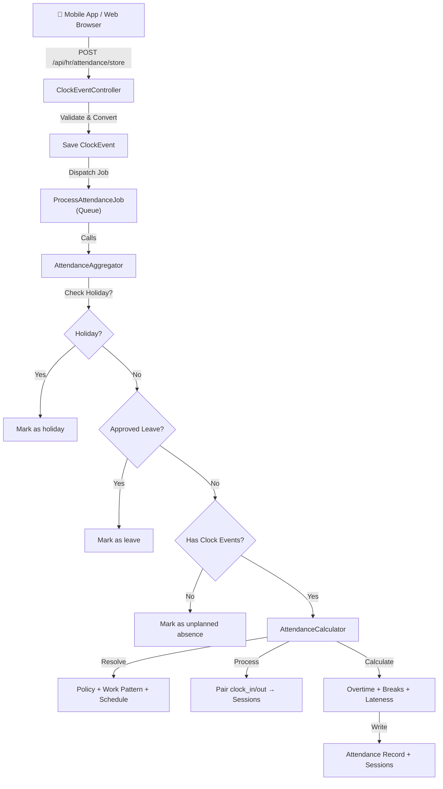

# Quick HR — Attendance System Documentation

> **Version:** 1.0  
> **Last Updated:** July 2026  
> **Module:** `app/Modules/Hr`

---

## Table of Contents

1. [Introduction](#1-introduction)
2. [Key Concepts & Glossary](#2-key-concepts--glossary)
3. [System Architecture](#3-system-architecture)
4. [Administrator Guide](#4-administrator-guide)
   - [4.1 Attendance Policies](#41-attendance-policies)
   - [4.2 Work Patterns](#42-work-patterns)
   - [4.3 Shifts](#43-shifts)
   - [4.4 Shift Schedules](#44-shift-schedules)
   - [4.5 Holidays & Leave](#45-holidays--leave)
   - [4.6 Interpreting Attendance Records](#46-interpreting-attendance-records)
5. [User Guide (HR / Payroll Staff)](#5-user-guide-hr--payroll-staff)
6. [API Endpoint Reference](#6-api-endpoint-reference)
7. [Queue & Jobs](#7-queue--jobs)
8. [Troubleshooting & FAQ](#8-troubleshooting--faq)
9. [Glossary](#9-glossary)

---

## 1. Introduction

The Quick HR Attendance System captures employee clock-in and clock-out events from mobile devices, web browsers, and biometric terminals, then processes them through a queue-based pipeline to produce daily attendance records with precise hour breakdowns, overtime calculations, break compliance checks, and violation detection.

**Key Features**

- **Multi-channel clock events** — accepts clock-in/clock-out from mobile apps (Android), web browsers, biometric devices, kiosks, and API integrations
- **Idempotent event ingestion** — duplicate clock events are detected and silently ignored, making retries safe
- **Queue-based processing** — clock events are saved immediately; attendance calculation runs asynchronously via [`ProcessAttendanceJob`](app/Modules/Hr/Jobs/ProcessAttendanceJob.php:13)
- **Multi-tier policy resolution** — attendance policies are resolved through a priority chain: Employee → Shift → Department → Location → Company → System Default
- **Dual-threshold overtime** — daily overtime (hours beyond `overtime_daily_threshold_hours`) and weekly overtime (cumulative regular hours beyond `overtime_weekly_threshold_hours`) with double-time support
- **Multi-rule break compliance** — supports JSON arrays like `[4, 8]` for multiple break-after thresholds with corresponding durations
- **Unpaid break deduction** — policy-defined unpaid break minutes are deducted from payable (`net_hours`) while actual hours are preserved for status determination
- **Holiday and leave awareness** — approved leave and company holidays automatically override normal attendance calculation
- **Unplanned absence detection** — days with no clock events and no approved leave are flagged as unplanned absences with `needs_review = true`
- **Full audit trail** — `calculation_metadata` stores the complete breakdown of every calculation for debugging and compliance

> **Integration with Payroll:** Attendance records are used for payroll calculation for `salaried_daily` and `hourly` employees. This integration can be enabled/disabled globally via the `PAYROLL_ATTENDANCE_INTEGRATION_ENABLED` setting. See the [Payroll Policy & Adjustments User Guide](#) for details.
---

## 2. Key Concepts & Glossary

### Clock Event (`clock_events` table)

A raw timestamp record of an employee action. Each event has an `event_type` of either `clock_in` or `clock_out`. Events arrive from the mobile app in Android format (`check-in` / `check-out`) and are converted to internal types by the controller. Additional event types supported in the UI include `break_start`, `break_end`, `meal_start`, and `meal_end`.

| Field | Description |
|---|---|
| `employee_id` | Internal employee ID (integer) |
| `employee_number` | Human-readable employee number (e.g. `EMP-2025-001`) |
| `event_type` | `clock_in` or `clock_out` |
| `timestamp` | Date and time of the event |
| `method` | Source: `web`, `mobile`, `biometric`, `kiosk`, `api`, `manual` |
| `latitude` / `longitude` | GPS coordinates (decimal degrees, 8 decimal places) |
| `location_name` | Human-readable location (e.g. "Jahi, Federal Capital Territory, Nigeria") |
| `device_id` / `device_name` | Device fingerprint for audit |
| `sync_status` | `pending`, `synced`, `failed`, or `manual` |

### Attendance Record (`attendances` table)

The computed daily attendance summary for one employee on one date. Exactly one record per employee per date (enforced by a unique index on `[employee_id, date]`). Created automatically when the first clock event for a day is processed.

**Status values:**

| Status | Meaning |
|---|---|
| `present` | Normal workday, all thresholds met |
| `absent` | No hours worked on a scheduled workday |
| `late` | Clocked in after the grace period |
| `half_day` | Worked ≤ 50% of expected hours |
| `incomplete` | Worked > 50% but < 90% of expected hours, or missing clock-out |
| `early_departure` | Clocked out before the early-departure grace window |
| `unscheduled` | Worked on a day not in the employee's work pattern |
| `holiday` | Company holiday (no work expected) |
| `leave` | Approved leave covers this day |
| `on_leave` | UI alias for `leave` |

**Key computed fields:**

| Field | Description |
|---|---|
| `net_hours` | Payable hours after unpaid break deduction |
| `regular_hours` | Hours within daily/weekly thresholds |
| `overtime_hours` | Hours beyond thresholds (paid at `overtime_multiplier`) |
| `double_time_hours` | Hours beyond `double_time_threshold_hours` (paid at `double_time_multiplier`) |
| `minutes_late` | Minutes clocked in after `scheduled_start + grace_period_minutes` |
| `minutes_early_departure` | Minutes clocked out before `scheduled_end − early_departure_grace_minutes` |
| `missed_break_minutes` | Total minutes of required breaks not taken |
| `needs_review` | `true` when violations exist or status is `incomplete`, `half_day`, or `unscheduled` |
| `calculation_metadata` | JSON with full breakdown: expected hours, overtime steps, break violations, etc. |

### Attendance Session (`attendance_sessions` table)

One continuous work period within a day. Created by pairing a `clock_in` event with the next `clock_out` event. An attendance record can have multiple sessions (e.g., clock in at 8 AM, out at 12 PM, in at 1 PM, out at 5 PM = two sessions).

| Field | Description |
|---|---|
| `session_type` | `work`, `paid_break`, `unpaid_break`, or `overtime` |
| `start_time` / `end_time` | Session boundaries (nullable `end_time` for orphaned clock-ins) |
| `duration_hours` | Computed duration |
| `clock_in_event_id` / `clock_out_event_id` | Links back to raw clock events |
| `is_overnight` | `true` if the session spans midnight |
| `validation_status` | `valid`, `missing_clock_out`, `overlaps`, `too_short`, `too_long` |

### Attendance Policy (`attendance_policies` table)

Defines the rules for calculating attendance: grace periods, overtime thresholds, break requirements, and multipliers. Policies are assigned polymorphically — they can be attached to a Company, Department, Location, or Shift via the `PolicyAssignment` model, or directly to an employee via `EmployeePosition.attendance_policy_id`.

### Work Pattern (`work_patterns` table)

Defines which days of the week an employee is expected to work and which shift applies. The `applicable_days` field stores day-of-week numbers (1=Monday through 7=Sunday) as a comma-separated string or JSON array. A work pattern links to a base [`Shift`](app/Modules/Hr/Models/Shift.php:17) and can optionally override its start/end times.

### Shift (`shifts` table)

Defines a named work period with `start_time`, `end_time`, and `duration_hours`. Supports an `is_overnight` flag for shifts that cross midnight. Each shift belongs to a `shift_category` (`regular`, `peak`, `weekend`, `holiday`, `emergency`, `training`).

### Shift Schedule (`shift_schedules` table)

An individual override that assigns a specific shift to a specific employee on a specific date. Takes precedence over work patterns and default shifts. Supports `start_time_override` and `end_time_override` for fine-grained adjustments.

### Grace Period

The number of minutes after the scheduled start time during which an employee can clock in without being marked late. Defined by `grace_period_minutes` (default: 5). A separate `early_departure_grace_minutes` (default: 5) applies to clocking out before the scheduled end time.

### Overtime

Hours worked beyond the daily threshold (`overtime_daily_threshold_hours`, default: 8) are classified as daily overtime. Additionally, when cumulative regular hours for the week exceed the weekly threshold (`overtime_weekly_threshold_hours`, default: 40), today's regular hours overflow into overtime. Overtime is capped at `max_daily_overtime_hours` (default: 4). Hours beyond `double_time_threshold_hours` (default: 12) are classified as double time.

### Break Compliance

The system checks whether employees took required breaks after working a certain number of continuous hours. The `requires_break_after_hours` and `break_duration_minutes` fields support both scalar values (e.g., `5` hours → `30` minutes) and JSON arrays for multiple rules (e.g., `[4, 8]` hours → `[15, 30]` minutes). Missed breaks are recorded in `missed_break_minutes` and detailed in `calculation_metadata.break_violations`.

### Policy Assignment

Policies are assigned through a polymorphic `PolicyAssignment` model (`assignable_type` / `assignable_id`). The resolution order is:

1. **Employee-specific** — `EmployeePosition.attendance_policy_id`
2. **Shift-specific** — `PolicyAssignment` where `assignable_type = 'App\Modules\Hr\Models\Shift'`
3. **Department** — `PolicyAssignment` where `assignable_type = 'App\Modules\Hr\Models\Department'`
4. **Location** — `PolicyAssignment` where `assignable_type = 'App\Modules\Hr\Models\Location'`
5. **Company** — `PolicyAssignment` where `assignable_type = 'App\Modules\Hr\Models\Company'`
6. **System default** — `AttendancePolicy` where `is_default = true` and `is_active = true`

---

## 3. System Architecture



### Component Descriptions

**API Layer ([`ClockEventController`](app/Modules/Hr/Http/Controllers/ClockEventController.php:15))** — Accepts clock events in Android format (`check-in`/`check-out` with millisecond timestamps), converts them to internal format, performs idempotency checks, saves raw [`ClockEvent`](app/Modules/Hr/Models/ClockEvent.php:16) records, and dispatches [`ProcessAttendanceJob`](app/Modules/Hr/Jobs/ProcessAttendanceJob.php:13) to the queue. Supports both single-event (`store`) and batch (`batchStore`) endpoints.

**Queue Layer ([`ProcessAttendanceJob`](app/Modules/Hr/Jobs/ProcessAttendanceJob.php:13))** — A queued job that runs asynchronously after each clock event is saved. It resolves the employee, then delegates to [`AttendanceAggregator`](app/Modules/Hr/Services/AttendanceAggregator.php:18). Configured with 3 retry attempts and exponential backoff (1 min, 5 min, 10 min).

**Aggregator ([`AttendanceAggregator`](app/Modules/Hr/Services/AttendanceAggregator.php:18))** — The orchestrator that decides which calculation path to take. It checks for holidays first, then approved leave, then the presence of clock events. If none of the special cases apply, it delegates to [`AttendanceCalculator`](app/Modules/Hr/Services/AttendanceCalculator.php:23) for full processing.

**Calculator ([`AttendanceCalculator`](app/Modules/Hr/Services/AttendanceCalculator.php:23))** — The core computation engine. It resolves the applicable policy, work pattern, and schedule through multi-tier priority chains, processes raw clock events into paired work sessions, and computes regular/overtime/double-time hours, lateness, early departure, and break compliance. Results are written to the [`Attendance`](app/Modules/Hr/Models/Attendance.php:23) record and [`AttendanceSession`](app/Modules/Hr/Models/AttendanceSession.php:17) records in a single database transaction.

---

## 4. Administrator Guide

### 4.1 Attendance Policies

Attendance policies are configured at **HR → Attendance Policies** in the web interface. Each policy defines the rules that govern how employee time is classified and paid.

#### All Policy Fields

| Field | Type | Default | Description |
|---|---|---|---|
| `name` | string | — | Human-readable policy name (e.g. "Standard Nigeria Policy") |
| `code` | string | auto | Unique policy code, auto-generated |
| `description` | text | null | Optional notes about the policy |
| `grace_period_minutes` | integer | 5 | Minutes after scheduled start before employee is marked late (max 60) |
| `early_departure_grace_minutes` | integer | 5 | Minutes before scheduled end that employee can leave without penalty (max 60) |
| `overtime_daily_threshold_hours` | decimal | 8 | Hours after which daily overtime begins (max 24) |
| `overtime_weekly_threshold_hours` | decimal | 40 | Cumulative regular hours after which weekly overtime begins (max 168) |
| `max_daily_overtime_hours` | decimal | 4 | Hard cap on daily overtime hours (max 24) |
| `overtime_multiplier` | decimal | 1.5 | Pay multiplier for overtime hours (1.0–3.0) |
| `double_time_threshold_hours` | decimal | 12 | Total daily hours after which double time applies (max 24) |
| `double_time_multiplier` | decimal | 2.0 | Pay multiplier for double-time hours (1.0–3.0) |
| `requires_break_after_hours` | string | `5` | Hours of continuous work after which a break is required. Supports JSON arrays |
| `break_duration_minutes` | string | `30` | Required break duration in minutes. Supports JSON arrays |
| `unpaid_break_minutes` | integer | 0 | Daily unpaid break minutes deducted from payable hours (max 240) |
| `country_code` | string | null | Applicable country (US, GB, CA, AU, IN, NG) |
| `state_code` | string | null | State/province code for jurisdiction-specific rules |
| `applies_to_shift_categories` | array | `["regular"]` | Which shift categories this policy covers |
| `effective_date` | date | required | Date the policy becomes active |
| `expiration_date` | date | null | Date the policy expires (optional) |
| `is_active` | boolean | true | Whether the policy is currently in effect |
| `is_default` | boolean | false | Whether this is the system-wide fallback policy |

#### Multi-Break Support

The `requires_break_after_hours` and `break_duration_minutes` fields accept JSON arrays for defining multiple break rules. For example:

- **Single rule:** `requires_break_after_hours = "5"`, `break_duration_minutes = "30"` — one 30-minute break required after 5 hours of continuous work
- **Multiple rules:** `requires_break_after_hours = "[4, 8]"`, `break_duration_minutes = "[15, 30]"` — a 15-minute break after 4 hours, and a 30-minute break after 8 hours

The system checks each rule independently. If a required break is not detected (no gap of sufficient duration between sessions), a violation is recorded.

#### Policy Assignment

Policies are assigned through the **Policy Assignments** interface. An assignment links a policy to one of:

- **Company** — applies to all employees in that company (unless overridden)
- **Department** — applies to all employees in that department
- **Location** — applies to all employees at that location
- **Shift** — applies to all employees assigned to that shift
- **Employee** — directly on the employee's position record (`attendance_policy_id`)

The resolution order is: Employee → Shift → Department → Location → Company → System Default. The first active, in-date policy found wins.

### 4.2 Work Patterns

Work patterns define an employee's regular working days and the shift for those days. Configured at **HR → Work Patterns**.

| Field | Type | Default | Description |
|---|---|---|---|
| `name` | string | — | Pattern name (e.g. "Standard Mon–Fri") |
| `code` | string | auto | Unique code, auto-generated |
| `pattern_type` | string | `recurring` | `recurring` (same every week), `rotating` (A/B week cycle), or `custom` |
| `rotation_weeks` | integer | 2 | Number of weeks in rotation cycle (2–4) |
| `shift_id` | foreign key | required | The base shift for days in this pattern |
| `applicable_days` | array | `[1,2,3,4,5]` | Day-of-week numbers: 1=Mon, 2=Tue, 3=Wed, 4=Thu, 5=Fri, 6=Sat, 7=Sun |
| `override_start_time` | time | null | Override the shift's start time for this pattern |
| `override_end_time` | time | null | Override the shift's end time for this pattern |
| `effective_date` | date | required | Date the pattern becomes active |
| `end_date` | date | null | Date the pattern expires |
| `is_active` | boolean | true | Whether the pattern is currently in effect |
| `is_default` | boolean | false | System-wide fallback pattern |

**`is_default` flag:** When set to `true`, this work pattern serves as the system fallback for any employee who does not have an explicit work pattern assigned. The system bypasses company scoping to find a default pattern, ensuring every employee has a schedule.

**`effective_date` / `expiration_date`:** These control the date range during which the pattern is active. The calculator checks `effective_date <= calculation_date` and `expiration_date >= calculation_date` (or null for no expiration).

### 4.3 Shifts

Shifts define named work periods. Configured at **HR → Shifts**.

| Field | Type | Default | Description |
|---|---|---|---|
| `name` | string | — | Shift name (e.g. "Morning Shift") |
| `code` | string | auto | Unique code |
| `shift_category` | string | `regular` | `regular`, `peak`, `weekend`, `holiday`, `emergency`, `training` |
| `start_time` | time | required | Shift start time (e.g. `08:00`) |
| `end_time` | time | required | Shift end time (e.g. `17:00`) |
| `duration_hours` | decimal | computed | Total payable hours for the shift |
| `is_overnight` | boolean | false | Whether the shift crosses midnight |
| `is_active` | boolean | true | Whether the shift is available for assignment |
| `is_default` | boolean | false | System-wide fallback shift |

**`is_overnight` flag:** When enabled, the system knows the shift spans two calendar dates (e.g., 22:00–06:00). This affects how sessions are classified and how the date boundary is handled.

**`duration_hours`:** This is the payable duration, which may differ from the raw `end_time − start_time` difference (e.g., an 8.5-hour shift with a 30-minute unpaid break might have `duration_hours = 8.0`).

### 4.4 Shift Schedules

Shift schedules are individual overrides that assign a specific shift to a specific employee on a specific date. They take the highest priority in schedule resolution (above work patterns and default shifts).

A shift schedule can optionally specify `start_time_override` and `end_time_override` to fine-tune the timing for that specific day without creating a new shift. Only published schedules (`is_published = true`) are considered.

### 4.5 Holidays & Leave

**Holidays:** When a company holiday is detected for a given date (matching either `date` or `observed_date` on the [`Holiday`](app/Modules/Hr/Models/Holiday.php) model, with `business_impact` of `office_closed` or `reduced_staff`), the attendance record is automatically set to `status = 'holiday'` with `net_hours = 0`, `is_approved = true`, and `needs_review = false`. No clock events are required.

**Approved Leave:** When an employee has an approved [`LeaveRequest`](app/Modules/Hr/Models/LeaveRequest.php) covering the date (`status = 'Approved'`, `start_date <= date <= end_date`), the attendance record is set to `status = 'leave'`. The `regular_hours` and `net_hours` are set to the employee's standard shift duration. The `hours_deducted` field reflects whether the leave type deducts from the employee's leave balance, and `is_paid_absence` reflects whether the leave is paid.

Both holiday and leave checks happen **before** clock event processing. If a holiday or approved leave exists, clock events for that day are ignored for calculation purposes.

### 4.6 Interpreting Attendance Records

#### All Status Values

| Status | Trigger Condition |
|---|---|
| `present` | Worked ≥ 90% of expected hours, no lateness, no early departure |
| `absent` | Zero hours worked on a scheduled day |
| `late` | Clocked in after `scheduled_start + grace_period_minutes` |
| `half_day` | Worked > 0 but ≤ 50% of expected hours |
| `incomplete` | Worked > 50% but < 90% of expected hours, or missing clock-out |
| `early_departure` | Clocked out before `scheduled_end − early_departure_grace_minutes` |
| `unscheduled` | Worked on a day not in the employee's work pattern |
| `holiday` | Company holiday — no work expected |
| `leave` | Approved leave covers this day |

#### Hour Fields

- **`regular_hours`** — Hours within the daily threshold, minus any weekly overflow into overtime. This is what gets paid at the base rate.
- **`overtime_hours`** — Hours beyond the daily threshold plus any weekly overflow. Paid at `overtime_multiplier` × base rate. Capped at `max_daily_overtime_hours`.
- **`double_time_hours`** — Hours beyond `double_time_threshold_hours`. Paid at `double_time_multiplier` × base rate.
- **`net_hours`** — Total payable hours: `regular_hours + overtime_hours + double_time_hours`, after unpaid break deduction. This is the figure used for payroll.

#### Review Flags

- **`needs_review`** — Set to `true` when any violation exists (late, early departure, missed break), or when the status is `incomplete`, `half_day`, or `unscheduled`. HR staff should review these records and either approve or adjust them.
- **`minutes_late`** — Minutes past the grace period. Only populated when the employee is actually late.
- **`minutes_early_departure`** — Minutes before the early-departure grace window. Only populated when the employee leaves early.
- **`missed_break_minutes`** — Sum of all required break minutes that were not taken.

#### `calculation_metadata` for Debugging

The `calculation_metadata` JSON field contains the full breakdown of every calculation step:

```json
{
  "expected_hours": 8.0,
  "overtime_calculation": {
    "daily_regular": 8.0,
    "daily_overtime": 0.0,
    "weekly_regular_so_far": 32.0,
    "weekly_threshold": 40,
    "overflow_into_overtime": 0,
    "final_regular": 8.0,
    "final_overtime": 0.0,
    "daily_threshold": 8,
    "max_daily_overtime": 4,
    "double_time_threshold": 12
  },
  "unpaid_break_deducted": 30,
  "violations": []
}
```

Use this field to understand exactly how the system arrived at a particular hour breakdown.

---

## 5. User Guide (HR / Payroll Staff)

### Viewing Daily Attendance

Navigate to **HR → Attendances** to see the list of all attendance records. Use the filters to narrow by date range, employee, department, status, or `needs_review` flag. Click any record to see:

- The employee's clock-in/clock-out times
- Work sessions with durations
- Hour breakdown (regular, overtime, double time)
- Any violations (lateness, early departure, missed breaks)
- The policy and work pattern used for calculation

### Manual Adjustments

When an attendance record needs correction (e.g., an employee forgot to clock out, or a biometric device malfunctioned), use the **Attendance Adjustment** feature:

1. Open the attendance record
2. Click **Adjust**
3. Modify the session start/end times, or add a missing session
4. Provide an adjustment reason
5. Save — the system will recalculate hours based on your changes

Adjustments are tracked with `is_adjusted = true`, `adjusted_by`, `adjusted_at`, and `adjustment_reason` on the session record.

### Approving Records

Records with `needs_review = true` should be reviewed by an HR manager:

1. Filter the attendance list by `needs_review = true`
2. Review each record's violations in `calculation_metadata`
3. If the record is correct as-is (e.g., the employee was genuinely late), click **Approve** to set `is_approved = true` and `needs_review = false`
4. If the record needs correction, create an adjustment first, then approve

### Handling Exceptions

| Scenario | Action |
|---|---|
| Employee forgot to clock out | Create an adjustment adding the missing clock-out time |
| Employee worked on a holiday | The system marks it as `holiday`; adjust if holiday work should be paid |
| Employee clocked in on a weekend (unscheduled) | Record shows `unscheduled` with `needs_review = true`; approve if authorized |
| Duplicate clock events | Automatically ignored — no action needed |
| Missing attendance record for a day | Dispatch a recalculation: see [Troubleshooting](#8-troubleshooting--faq) |

---

## 6. API Endpoint Reference

### POST /api/hr/attendance/store

Records a single clock event and queues attendance calculation.

**Authentication:** Required (`auth:sanctum`)

**Request Body (Android format):**

```json
{
  "employee_id": "1",
  "employee_number": "EMP-2025-001",
  "event_type": "check-in",
  "timestamp": 1766764808298,
  "device_id": "c213a4332a9f801a",
  "device_name": "INFINIX Infinix X6835B",
  "location_name": "Jahi, Federal Capital Territory, Nigeria",
  "timezone": "Africa/Lagos",
  "notes": "",
  "latitude": 9.1025352,
  "longitude": 7.4430279
}
```

**Field Descriptions:**

| Field | Type | Required | Description |
|---|---|---|---|
| `employee_id` | string | Yes | Employee identifier (for reference) |
| `employee_number` | string | Yes | Must match an existing employee's `employee_number` |
| `event_type` | string | Yes | `check-in` or `check-out` |
| `timestamp` | numeric | Yes | Unix timestamp in **milliseconds** |
| `device_id` | string | No | Device hardware identifier |
| `device_name` | string | No | Human-readable device name |
| `location_name` | string | No | GPS-derived location description |
| `timezone` | string | No | IANA timezone (e.g. `Africa/Lagos`) |
| `notes` | string | No | Free-text notes |
| `latitude` | numeric | No | Decimal degrees (−90 to 90) |
| `longitude` | numeric | No | Decimal degrees (−180 to 180) |

**Validation Rules:**

- `employee_number` must exist in the `employees` table
- `event_type` must be `check-in` or `check-out`
- `timestamp` must be numeric (milliseconds)
- `latitude` must be between −90 and 90
- `longitude` must be between −180 and 180

**Success Response (201):**

```json
{
  "success": true,
  "message": "Clock event recorded",
  "event_id": 42,
  "data": {
    "employee_number": "EMP-2025-001",
    "timestamp": "2026-06-26 08:00:08",
    "event_type": "clock_in"
  }
}
```

**Duplicate Response (200):**

```json
{
  "success": false,
  "message": "Duplicate event ignored",
  "status": "duplicate",
  "data": {
    "employee_number": "EMP-2025-001",
    "timestamp": "2026-06-26 08:00:08",
    "event_type": "clock_in"
  }
}
```

**Error Response (422):**

```json
{
  "success": false,
  "message": "Validation failed",
  "errors": {
    "employee_number": ["The selected employee number is invalid."]
  }
}
```

### POST /api/hr/attendance/batch-store

Accepts an array of clock events in the same format as the single endpoint.

**Request Body:**

```json
[
  {
    "employee_id": "1",
    "employee_number": "EMP-2025-001",
    "event_type": "check-in",
    "timestamp": 1766764808298,
    "latitude": 9.1025352,
    "longitude": 7.4430279,
    "timezone": "Africa/Lagos"
  },
  {
    "employee_id": "1",
    "employee_number": "EMP-2025-001",
    "event_type": "check-out",
    "timestamp": 1766764816393,
    "latitude": 9.1025352,
    "longitude": 7.4430279,
    "timezone": "Africa/Lagos"
  }
]
```

**Partial Success Behavior:** Each event in the batch is processed independently. Validation failures on one event do not affect others. The response includes a summary and per-event results:

```json
{
  "success": true,
  "message": "Batch processing completed",
  "summary": {
    "total_processed": 2,
    "successfully_created": 1,
    "duplicates_ignored": 1,
    "failed": 0
  },
  "detailed_results": [
    { "status": "created", "event_id": 42, "message": "Clock event recorded" },
    { "status": "duplicate", "message": "Duplicate event ignored" }
  ]
}
```

### Idempotency

The system prevents duplicate clock events by checking for an existing record with the same `employee_id`, `timestamp`, and `event_type` before saving. If a match is found, the event is silently ignored and a `duplicate` status is returned. This makes it safe for mobile apps to retry failed submissions without creating duplicate records.

---

## 7. Queue & Jobs

### ProcessAttendanceJob

[`ProcessAttendanceJob`](app/Modules/Hr/Jobs/ProcessAttendanceJob.php:13) is the queued job responsible for calculating attendance after each clock event is saved.

**What it does:**

1. Receives an `employeeId` (integer) and `date` (string, `Y-m-d` format)
2. Looks up the employee by ID
3. Calls [`AttendanceAggregator::recalculateForDay()`](app/Modules/Hr/Services/AttendanceAggregator.php:32) with the employee's `employee_number` and date
4. The aggregator checks for holidays, leave, and clock events, then delegates to the calculator

**How it's triggered:**

- Automatically dispatched by [`ClockEventController::processClockEvent()`](app/Modules/Hr/Http/Controllers/ClockEventController.php:153) after saving each clock event
- Can also be dispatched manually for recalculation: `ProcessAttendanceJob::dispatch($employeeId, $date)`

**Retry Logic:**

| Setting | Value |
|---|---|
| `$tries` | 3 |
| `$backoff` | [60, 300, 600] (1 min, 5 min, 10 min) |

If all 3 attempts fail, the job is moved to the failed jobs table.

**Failed Job Logging:**

The [`failed()`](app/Modules/Hr/Jobs/ProcessAttendanceJob.php:35) method logs the employee ID, date, error message, and full stack trace. Failed jobs can be inspected with:

```bash
php artisan queue:failed
```

**Monitoring:**

If using Laravel Horizon, failed attendance jobs appear in the Horizon dashboard under "Failed Jobs." The `sync_status` field on [`ClockEvent`](app/Modules/Hr/Models/ClockEvent.php:16) records can also be monitored — events that remain `pending` for an extended period may indicate queue issues.

---

## 8. Troubleshooting & FAQ

### Missing Clock-Out → Attendance Marked `incomplete`

**Symptom:** An employee's attendance shows `status = 'incomplete'` with `needs_review = true`.

**Cause:** The employee clocked in but never clocked out. The calculator creates an orphaned session with `end_time = null` and `duration = 0`. The `determineStatus()` method sees hours below the 90% threshold and returns `incomplete`.

**Resolution:** Create an attendance adjustment to add the missing clock-out time, or manually set the end time on the open session. The system will recalculate.

### Unscheduled Day → `needs_review = true`, Status `unscheduled`

**Symptom:** An employee who worked on a weekend or day off shows `status = 'unscheduled'`.

**Cause:** The calculation date's day-of-week (1–7) is not in the work pattern's `applicable_days`. The calculator overrides the status to `unscheduled` regardless of hours worked.

**Resolution:** If the work was authorized, approve the record. If this is a recurring pattern, update the employee's work pattern or create a shift schedule for those dates.

### Incorrect Overtime → Check `calculation_metadata.breakdown`

**Symptom:** Overtime hours seem too high or too low.

**Cause:** Overtime is calculated in multiple steps — daily threshold, weekly overflow, max daily cap, and double-time threshold. The interaction between these can produce unexpected results.

**Resolution:** Inspect `calculation_metadata.breakdown.overtime_calculation` on the attendance record. It shows:
- `daily_regular` / `daily_overtime` — the daily split
- `weekly_regular_so_far` / `weekly_threshold` — whether weekly overflow kicked in
- `overflow_into_overtime` — how many regular hours were reclassified
- `daily_overtime_capped` — whether the max daily cap was applied

### Break Violations → Check `missed_break_minutes` and `calculation_metadata.break_violations`

**Symptom:** An employee shows `missed_break_minutes > 0` but they believe they took breaks.

**Cause:** The break compliance checker looks for gaps between sessions that are at least as long as the required break duration. If the employee clocked out and back in quickly, or if sessions are contiguous, the break may not be detected.

**Resolution:** Check `calculation_metadata.breakdown.violations` for details on which break rules were violated. Ensure the employee is clocking out for breaks and clocking back in — the system cannot detect breaks taken during a single continuous session.

### How to Recalculate Attendance

To manually trigger recalculation for a specific employee and date:

```bash
# Via Tinker or a custom command:
ProcessAttendanceJob::dispatch($employeeId, '2026-06-26');
```

Or use the aggregator directly:

```php
$aggregator = app(\App\Modules\Hr\Services\AttendanceAggregator::class);
$aggregator->recalculateForDay('EMP-2025-001', '2026-06-26');
```

For a date range:

```php
$aggregator->recalculateDateRange('EMP-2025-001', '2026-06-01', '2026-06-30');
```

### Company/Department Snapshots Not Updating

**Symptom:** An employee changed departments, but old attendance records still show the previous department name.

**Cause:** The `company` and `department` columns on the [`Attendance`](app/Modules/Hr/Models/Attendance.php:23) record are **historical snapshots** set only when the record is first created via [`getOrCreateAttendanceRecord()`](app/Modules/Hr/Traits/HandlesAttendanceRecord.php:16). They are never updated on subsequent calculations. This is by design — attendance records should reflect the organizational structure at the time the work was performed.

**Resolution:** This is expected behavior. No action needed. If a record was created under the wrong department, it can be manually corrected.

---

## 9. Glossary

| Term | Definition |
|---|---|
| **Clock Event** | A raw timestamp record of an employee action (`clock_in` or `clock_out`), stored in `clock_events` |
| **Attendance Record** | The computed daily summary for one employee on one date, stored in `attendances` |
| **Attendance Session** | One continuous work period within a day, created by pairing a clock-in with a clock-out, stored in `attendance_sessions` |
| **Attendance Policy** | Rules governing grace periods, overtime thresholds, break requirements, and pay multipliers, stored in `attendance_policies` |
| **Work Pattern** | Defines which days of the week an employee works and which shift applies, stored in `work_patterns` |
| **Shift** | A named work period with start/end times, stored in `shifts` |
| **Shift Schedule** | An individual override assigning a specific shift to an employee on a specific date, stored in `shift_schedules` |
| **Policy Assignment** | Polymorphic link between a policy and a company, department, location, or shift, stored in `policy_assignments` |
| **Grace Period** | Minutes after scheduled start (or before scheduled end) during which clocking in/out does not trigger a violation |
| **Overtime (Daily)** | Hours worked beyond `overtime_daily_threshold_hours` in a single day |
| **Overtime (Weekly)** | Regular hours reclassified as overtime when cumulative weekly regular hours exceed `overtime_weekly_threshold_hours` |
| **Double Time** | Hours worked beyond `double_time_threshold_hours` in a single day, paid at `double_time_multiplier` |
| **Break Compliance** | Verification that employees took required breaks after working continuous hours, defined by `requires_break_after_hours` and `break_duration_minutes` |
| **Unpaid Break** | Minutes deducted from payable hours, defined by `unpaid_break_minutes` |
| **Idempotency** | Duplicate clock events (same employee, timestamp, and event type) are silently ignored |
| **`net_hours`** | Payable hours after unpaid break deduction: `regular_hours + overtime_hours + double_time_hours` |
| **`calculation_metadata`** | JSON field storing the full step-by-step breakdown of an attendance calculation |
| **`needs_review`** | Flag indicating the record requires HR attention (violations, incomplete, half-day, or unscheduled) |
| **Orphaned Clock-In** | A clock-in event with no matching clock-out; creates a session with `end_time = null` and `duration = 0` |
| **Company Scope** | Multi-tenancy mechanism ensuring data isolation between companies |
| **Snapshot** | The `company` and `department` text columns on attendance records, set at creation time and never updated |
