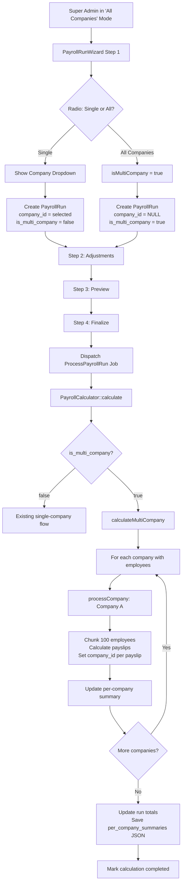

# All Companies Payroll Processing — Technical Analysis & Implementation Plan

**Date**: 2026-07-20  
**Status**: Planning Phase — Awaiting Review  
**Scope**: Adding multi-company payroll run capability to the Quick-HR Laravel/Livewire system

---

## Table of Contents

1. [Part 1: Business Need Analysis](#part-1-business-need-analysis)
2. [Part 2: Implementation Plan](#part-2-implementation-plan)
   - [2.1 Database Schema Design](#21-database-schema-design)
   - [2.2 Wizard UI Changes](#22-wizard-ui-changes)
   - [2.3 PayrollRunWizard Component Changes](#23-payrollrunwizard-component-changes)
   - [2.4 Core Payroll Calculation Changes](#24-core-payroll-calculation-changes)
   - [2.5 ProcessPayrollRun Job Changes](#25-processpayrollrun-job-changes)
   - [2.6 Reporting and Display](#26-reporting-and-display)
   - [2.7 Reversal and Adjustment](#27-reversal-and-adjustment)
   - [2.8 Testing Strategy](#28-testing-strategy)
   - [2.9 Migration and Rollout Plan](#29-migration-and-rollout-plan)

---

## Part 1: Business Need Analysis

### 1.1 The Multi-Entity Payroll Problem

In Nigeria and West Africa, it is common for a single organization to operate through multiple legal entities. A holding company may manage payroll for 5–15 subsidiaries, each a distinct legal entity with its own Tax Identification Number (TIN), pension registration, and NHF/NSITF codes. The HR/payroll administrator—often a single person or small team—must run payroll separately for each entity.

**Current Quick-HR behavior**: When a super admin uses the "All Companies" mode (`session('current_company_id') === 0`), the [`PayrollRunWizard`](app/Modules/Hr/Http/Livewire/Payroll/PayrollRunWizard.php:89) forces the user to select a single company from a dropdown (lines 110–112). This means processing 10 subsidiaries requires 10 separate wizard runs.

### 1.2 Real-World Use Cases

| Scenario | Description |
|---|---|
| **Holding Company** | A group like "Chi Limited" with subsidiaries (Chi Beverages, Chi Snacks, Chi Logistics). All follow the same monthly pay schedule. The group HR runs payroll once for all entities. |
| **Professional Employer Organization (PEO)** | A PEO managing payroll for 50+ small businesses. Each client is a separate legal entity. The PEO administrator wants to process all clients sharing the same pay period in one batch. |
| **Multi-School Board** | A religious or private school board operating 5+ schools as separate entities. Teachers across all schools are on the same monthly cycle. |
| **Consolidated Reporting** | A CFO needs a consolidated labor cost report across all group entities for board presentation—without manual spreadsheet merges. |

### 1.3 Legal & Compliance Considerations

**Nigeria-specific requirements**:

| Requirement | Implication |
|---|---|
| **PAYE Tax** | Each entity must file PAYE returns separately to its respective State Internal Revenue Service (SIRS). The `PayrollRun` totals must be disaggregatable per entity. |
| **Pension (PENCOM)** | Each entity remits to its registered Pension Fund Administrator (PFA). Employee pension contributions must be per-entity, per-employee. |
| **NHF (National Housing Fund)** | Employer + employee contributions remitted per entity. |
| **NSITF** | Employer-only contribution, per entity. |
| **Audit Trail** | Each legal entity must maintain independent payroll records for audit purposes. Payslips must reference the correct entity. |

**Conclusion**: A multi-company payroll run must produce **per-entity payslips, per-entity statutory reports, and per-entity financial summaries**—while offering a consolidated view.

### 1.4 Industry Examples

| System | How They Handle It |
|---|---|
| **Sage 300 People** | "Group Payroll" module: runs payroll per company sequentially, aggregates results. Allows per-company configurations. |
| **SeamlessHR** | Multi-entity payroll: admin selects companies, system batches them. Each entity's payslips are generated independently. |
| **Bento** | "Bulk Payroll": select multiple companies, system processes them in queue, produces per-company reports and consolidated. |
| **ADP Workforce** | "Multi-EIN Payroll": each EIN (Employer Identification Number) processes separately but within a unified dashboard. |

### 1.5 Risks and Drawbacks

| Risk | Mitigation |
|---|---|
| **Cross-entity data contamination** | Always set `company_id` on every payslip; use per-company transactions. |
| **One entity delaying all others** | Process entities independently; partial success/failure model. |
| **Data protection / GDPR/NDPR** | Payslip data is per-entity; employee PII stays within their legal entity context. |
| **Reversal complexity** | Reverse per-entity; never reverse the entire multi-company run atomically without per-entity audit. |
| **Large dataset performance** | Chunk within each company (existing 100-employee chunking), then iterate companies sequentially. |

### 1.6 Conclusion and Recommendation

**This is a plausible and advisable feature** with clear business value for multi-entity organizations. The recommendation is:

1. **Implement as an opt-in mode** within the existing wizard. Single-company flow remains the default and is completely unchanged.
2. **Process companies sequentially**, not in parallel, to maintain data integrity and transaction control.
3. **Each company's payslips are atomically independent** — a failure in Company C does not undo Company A and B's successful processing.
4. **Store a consolidated PayrollRun** with `company_id = NULL` (or `0`) plus a `per_company_summaries` JSON column for disaggregation.
5. **Feature-flag the capability** so it can be rolled out gradually.

---

## Part 2: Implementation Plan

### 2.1 Database Schema Design

#### 2.1.1 Decision: How to Mark a PayrollRun as "All Companies"

**Recommendation: `company_id = NULL` + new `is_multi_company` boolean column**

| Option | Pros | Cons | Verdict |
|---|---|---|---|
| `company_id = NULL` | Already nullable in the schema; naturally means "no specific company" | Existing runs with explicit company won't match | **Chosen** (combined with boolean flag) |
| `company_id = 0` | Compatible with `session('current_company_id') === 0` pattern | Sentinel values are anti-patterns in relational databases; `0` could accidentally reference a company row | Rejected |
| New `is_multi_company` boolean only | Explicit intent | Doesn't solve the scope-fallback problem alone | **Chosen as companion** |
| Separate pivot table `payroll_run_companies` | Normalized, queryable | Over-engineering for a single flag; adds join complexity | Rejected for MVP |

**Final design**: `company_id` remains nullable. When a run covers all companies, `company_id = NULL` and `is_multi_company = true`. When a single-company run, `company_id = [company ID]` and `is_multi_company = false`.

#### 2.1.2 How `CompanyScope` Interacts

[`CompanyScope`](app/Modules/Admin/Scopes/CompanyScope.php:18–26) applies `WHERE company_id = $sessionCompanyId` only when `$sessionCompanyId` is truthy (non-zero, non-null). When `company_id = NULL`, the scope's `WHERE company_id = NULL` clause would match **zero rows** because `NULL = NULL` is falsy in SQL. This means:

- **Single-company user** with `session('current_company_id') = 5`: scope filters to `WHERE company_id = 5`. They will NOT see multi-company runs (which have `company_id = NULL`). **Correct behavior**.
- **Super admin** with `session('current_company_id') = 0` or `null`: scope applies NO filter. They WILL see multi-company runs alongside single-company ones. **Correct behavior**.

**No changes needed to `CompanyScope` or `HasCompanyScope`.** The existing logic already handles `NULL` company_id correctly for our purposes.

#### 2.1.3 Payslip `company_id`

[`PayrollPayslip`](app/Modules/Hr/Models/PayrollPayslip.php:36) already has `company_id` in its `$fillable`, and the `payroll_payslips` table already has a `company_id` nullable FK column. When creating payslips during a multi-company run:

- Each payslip's `company_id` should be set to the **employee's company**, not the PayrollRun's `company_id`.
- This is already derivable via the employee relationship (`$employee->company_id`).

#### 2.1.4 New Columns, Indexes, Tables

**New columns on `payroll_runs`**:

```sql
ALTER TABLE payroll_runs
    ADD COLUMN is_multi_company BOOLEAN NOT NULL DEFAULT FALSE AFTER company_id,
    ADD COLUMN per_company_summaries JSON NULL AFTER failure_reason,
    ADD INDEX idx_is_multi_company (is_multi_company);
```

**`per_company_summaries` JSON structure**:

```json
{
    "companies": [
        {
            "company_id": 1,
            "company_name": "Chi Beverages Ltd",
            "status": "completed",
            "total_employees": 45,
            "gross_pay": 8500000.00,
            "total_deductions": 1200000.00,
            "total_taxes": 950000.00,
            "net_pay": 6350000.00,
            "employer_contributions": 850000.00,
            "processed_at": "2026-07-20T10:30:00+01:00"
        },
        {
            "company_id": 2,
            "company_name": "Chi Snacks Ltd",
            "status": "completed",
            "total_employees": 120,
            ...
        }
    ],
    "failed_companies": [
        {
            "company_id": 3,
            "company_name": "Chi Logistics Ltd",
            "status": "failed",
            "error": "Pay policy resolution failed: circular parent reference"
        }
    ]
}
```

**New index on `payroll_payslips`** (already has `company_id` index from migration):

No new indexes needed on payslips—the existing `company_id` index at line 14 of [`2026_06_12_142514_create_payroll_payslips_table.php`](app/Modules/Hr/Database/Migrations/2026_06_12_142514_create_payroll_payslips_table.php:14) suffices.

#### 2.1.5 Migration File

A new migration should be created: `database/migrations/2026_07_20_add_multi_company_to_payroll_runs.php`

It will:
1. Add `is_multi_company` boolean column (default `false`)
2. Add `per_company_summaries` JSON column (nullable)
3. Add index on `is_multi_company`

---

### 2.2 Wizard UI Changes

#### 2.2.1 Current State

The wizard blade at [`payroll-run-wizard.blade.php`](app/Modules/Hr/Resources/views/livewire/payroll/payroll-run-wizard.blade.php:91–111) currently shows a company dropdown when `isAllCompaniesMode()` is true, forcing the user to pick a single company. The label says: "You are viewing all companies. Please select the company this payroll run belongs to."

#### 2.2.2 Proposed Changes

In "All Companies" mode (super admin with `session('current_company_id') === 0`), Step 1 should show a **radio button group** instead of a simple dropdown:

```
┌─────────────────────────────────────────────────────┐
│ Process Payroll For:                                │
│                                                     │
│  ○ Single Company                                   │
│    [Company Dropdown ▼] (shown only if selected)    │
│                                                     │
│  ● All Companies                                    │
│    ℹ️ 5 companies will be processed on the "[Monthly│
│    Pay]" schedule. Payslips will be per-entity and  │
│    statutory reports will remain separate.          │
└─────────────────────────────────────────────────────┘
```

**Conditional logic**:
- If `session('current_company_id')` is a specific company ID (not 0/null): **no radio group shown**. The company is auto-set. Backward compatible.
- If `session('current_company_id') === 0` (All Companies): **radio group is shown** with "Single Company" and "All Companies" options.
- If `session('current_company_id')` is null (not set): same as All Companies mode.

**Validation**:
- If "Single Company" is selected, `companyId` is required and must be a valid company.
- If "All Companies" is selected, no `companyId` validation needed; instead, validate that at least one company has active employees on the selected pay schedule.

#### 2.2.3 Step-by-Step User Flow

| Step | Screen | Multi-Company Changes |
|---|---|---|
| **Step 1** | Payroll Details | Radio group added. If "All Companies", a info box shows: count of companies with employees on the selected schedule, total employee count, and a warning about processing time for large datasets. |
| **Step 2** | Adjustments | [`PayrollWizardAdjustments`](app/Modules/Hr/Http/Livewire/Payroll/PayrollWizardAdjustments.php) already supports filtering by company (the `$filterCompany` property at line 31). In multi-company mode, this filter becomes more prominent—perhaps a company column in the table, or a company-grouped view. |
| **Step 3** | Review & Preview | Existing preview component. In multi-company mode, show per-company breakdowns (total employees, gross pay per company). |
| **Step 4** | Finalize | Same flow. Dispatches `ProcessPayrollRun` job which now handles multi-company. |

---

### 2.3 PayrollRunWizard Component Changes

File: [`app/Modules/Hr/Http/Livewire/Payroll/PayrollRunWizard.php`](app/Modules/Hr/Http/Livewire/Payroll/PayrollRunWizard.php)

#### 2.3.1 New Properties

```php
// Add to existing properties (around line 23):
public bool $isMultiCompany = false;         // "All Companies" radio selected
public ?array $eligibleCompanies = null;     // Companies with employees on selected schedule
public int $eligibleCompanyCount = 0;        // Count for display
public int $totalEligibleEmployees = 0;      // Total employees across all eligible companies
```

#### 2.3.2 New Computed Property

Add a method to derive eligible companies whenever `pay_schedule_id` changes:

```php
public function updatedPayScheduleId($value): void
{
    $this->eligibleCompanies = $this->computeEligibleCompanies();
}

protected function computeEligibleCompanies(): array
{
    if (!$this->pay_schedule_id) {
        return [];
    }

    // ⚠️ Must use withoutCompanyScope() because we need ALL companies' employees
    $positions = EmployeePosition::withoutCompanyScope()
        ->where('pay_schedule_id', $this->pay_schedule_id)
        ->where('employment_status', 'Active')
        ->with('employee.company')
        ->get();

    $byCompany = $positions->groupBy(fn($p) => $p->employee->company_id ?? 0);

    $result = [];
    foreach ($byCompany as $companyId => $group) {
        $company = $group->first()->employee->company;
        $result[] = [
            'company_id' => $companyId,
            'company_name' => $company?->name ?? 'Unassigned',
            'employee_count' => $group->count(),
        ];
    }

    return $result;
}
```

#### 2.3.3 Changes to `goToStep2()`

The current method at lines 101–152 needs modification. The key change is at lines 126 and 138 where `company_id` is set:

```php
// Line 126: current code
'company_id' => $this->isAllCompaniesMode() ? $this->companyId : session('current_company_id'),

// New code:
'company_id' => $this->isMultiCompany ? null : (
    $this->isAllCompaniesMode() ? $this->companyId : session('current_company_id')
),
'is_multi_company' => $this->isMultiCompany,
```

#### 2.3.4 Changes to `mount()`

Add restoration of `isMultiCompany` from session (around line 38–64):

```php
$this->isMultiCompany = $data['isMultiCompany'] ?? false;
```

And in `saveToSession()` (around lines 71–82), add:

```php
'isMultiCompany' => $this->isMultiCompany,
```

#### 2.3.5 Validation Changes

In `goToStep2()`, the validation at lines 103–113 becomes:

```php
$rules = [
    'pay_schedule_id' => 'required|exists:pay_schedules,id',
    'period_start' => 'required|date',
    'period_end' => 'required|date|after:period_start',
    'title' => 'required|unique:payroll_runs,title,' . $this->payrollRunId,
];

if ($this->isAllCompaniesMode() && !$this->isMultiCompany) {
    // Single company within "All Companies" mode
    $rules['companyId'] = 'required|integer|exists:companies,id';
}

if ($this->isMultiCompany) {
    // Validate at least one company has employees on this schedule
    // (implicitly checked by eligibleCompanies having entries)
    if (empty($this->eligibleCompanies)) {
        $this->addError('isMultiCompany', 
            'No companies have active employees on the selected pay schedule.');
        return;
    }
}

$this->validate($rules);
```

---

### 2.4 Core Payroll Calculation Changes

#### 2.4.1 Overview

The calculation currently in [`PayrollCalculator::calculate()`](app/Modules/Hr/Services/Payroll/PayrollCalculator.php:24–71) processes employees for a single company (via the implicit `CompanyScope` on `EmployeePosition`). For multi-company, we need to:

1. **Iterate over all companies** that have employees on the run's pay schedule
2. **For each company**, temporarily override the company context, process that company's employees, and aggregate results
3. **Maintain progress** across the entire multi-company run
4. **Update per-company summaries** on the `PayrollRun`

#### 2.4.2 New Entry Point: `calculateMultiCompany()`

Add a new method to `PayrollCalculator`:

```php
/**
 * Calculate payroll for a multi-company run.
 * Iterates companies sequentially, processing each company's employees
 * independently within its own transaction boundary.
 */
public function calculateMultiCompany(PayrollRun $run): void
{
    $this->run = $run;

    // 1. Determine which companies have employees on this schedule
    $positions = EmployeePosition::withoutCompanyScope()
        ->where('pay_schedule_id', $this->run->pay_schedule_id)
        ->where('employment_status', 'Active')
        ->with('employee')
        ->get();

    $companyEmployeeMap = $positions->groupBy(
        fn($p) => $p->employee->company_id ?? 0
    );

    $totalEmployees = $positions->count();

    // 2. Initialize progress (overall)
    \App\Modules\Hr\Models\PayrollRunProgress::updateOrCreate(
        ['payroll_run_id' => $this->run->id],
        [
            'total_employees' => $totalEmployees,
            'processed_employees' => 0,
            'status' => 'processing',
        ]
    );

    // 3. Clear all existing payslips (single transaction, quick)
    DB::transaction(function () {
        PayrollPayslip::where('payroll_run_id', $this->run->id)->delete();
    });

    // 4. Process each company
    $perCompanySummaries = [];
    $failedCompanies = [];

    foreach ($companyEmployeeMap as $companyId => $companyPositions) {
        try {
            $summary = $this->processCompany(
                $companyId,
                $companyPositions,
                $companyEmployeeMap->keys()->count()
            );
            $perCompanySummaries[] = $summary;
        } catch (\Exception $e) {
            Log::error("Multi-company payroll: Company #{$companyId} failed", [
                'error' => $e->getMessage(),
                'run_id' => $this->run->id,
            ]);
            $failedCompanies[] = [
                'company_id' => $companyId,
                'company_name' => Company::find($companyId)?->name ?? 'Unknown',
                'status' => 'failed',
                'error' => substr($e->getMessage(), 0, 500),
            ];
        }
    }

    // 5. Mark progress complete
    \App\Modules\Hr\Models\PayrollRunProgress::where('payroll_run_id', $this->run->id)
        ->update(['status' => 'completed']);

    // 6. Update run totals and per-company summaries
    $this->updateRunTotals();
    $this->run->update([
        'per_company_summaries' => json_encode([
            'companies' => $perCompanySummaries,
            'failed_companies' => $failedCompanies,
        ]),
    ]);
}
```

#### 2.4.3 New Method: `processCompany()`

```php
/**
 * Process all employees for a single company within a multi-company run.
 * Uses the EXISTING calculateForEmployee() method for per-employee logic.
 *
 * @param int $companyId
 * @param \Illuminate\Support\Collection $positions  EmployeePosition instances for this company
 * @param int $totalCompanies  Total number of companies being processed
 * @return array  Company summary for per_company_summaries
 */
protected function processCompany(
    int $companyId,
    Collection $positions,
    int $totalCompanies
): array {
    $company = Company::find($companyId);
    $companyName = $company?->name ?? 'Unknown';

    Log::info("Processing company: {$companyName} (#{$companyId})", [
        'run_id' => $this->run->id,
        'employee_count' => $positions->count(),
    ]);

    $processedCount = 0;
    $companyGrossPay = 0;
    $companyDeductions = 0;
    $companyTaxes = 0;
    $companyEmployerContributions = 0;
    $companyNetPay = 0;

    // Process employees in chunks (reuse existing chunk size of 100)
    $positions->chunk(100)->each(function ($chunk) use (
        &$processedCount, &$companyGrossPay, &$companyDeductions,
        &$companyTaxes, &$companyEmployerContributions, &$companyNetPay,
        $companyId
    ) {
        foreach ($chunk as $position) {
            DB::transaction(function () use (
                $position, &$processedCount, &$companyGrossPay,
                &$companyDeductions, &$companyTaxes,
                &$companyEmployerContributions, &$companyNetPay,
                $companyId
            ) {
                // Use the existing single-employee calculator
                $payslip = $this->calculateForEmployee($position);

                // Override the payslip's company_id (it may have been
                // set from the session or left null)
                $payslip->update(['company_id' => $companyId]);

                $companyGrossPay += $payslip->gross_pay;
                $companyDeductions += $payslip->total_deductions;
                $companyTaxes += $payslip->total_taxes;
                $companyNetPay += $payslip->net_pay;
                $companyEmployerContributions += $payslip->employer_contribution_total ?? 0;
            });

            $processedCount++;

            // Update overall progress
            \App\Modules\Hr\Models\PayrollRunProgress::where('payroll_run_id', $this->run->id)
                ->increment('processed_employees');
        }
    });

    return [
        'company_id' => $companyId,
        'company_name' => $companyName,
        'status' => 'completed',
        'total_employees' => $processedCount,
        'gross_pay' => round($companyGrossPay, 2),
        'total_deductions' => round($companyDeductions, 2),
        'total_taxes' => round($companyTaxes, 2),
        'net_pay' => round($companyNetPay, 2),
        'employer_contributions' => round($companyEmployerContributions, 2),
        'processed_at' => now()->toIso8601String(),
    ];
}
```

#### 2.4.4 Changes to Existing `calculate()` Method

Add a dispatch check at the beginning of `calculate()` (line 24):

```php
public function calculate(PayrollRun $run): void
{
    $this->run = $run;

    // → NEW: Route multi-company runs to the specialized method
    if ($run->is_multi_company) {
        $this->calculateMultiCompany($run);
        return;
    }

    // ... existing single-company logic unchanged ...
}
```

#### 2.4.5 Company Context Handling During Calculation

**Critical insight from [`PayrollWizardAdjustments::mount()`](app/Modules/Hr/Http/Livewire/Payroll/PayrollWizardAdjustments.php:54–61)**: The adjustments component already handles the case where `CompanyScope` hides a payroll run—it uses `withoutCompanyScope()` to find it, then temporarily switches the session. We follow the same pattern but for employees.

When processing Company #5 within a multi-company run:

1. The `EmployeePosition` query in `processCompany()` receives already-fetched positions (pre-grouped, no scope issue).
2. However, `resolvePoliciesForEmployee()` at line 408 queries `PayrollPolicyAssignment` and `PayrollPolicy`—these models may also be company-scoped. **They are not** (based on the code, they use no `HasCompanyScope` trait), so no issue.
3. The `Employee` model at line 26 of [`Employee.php`](app/Modules/Hr/Models/Employee.php:28) DOES use `HasCompanyScope`. When we do `EmployeePosition::withoutCompanyScope()`, the positions are fetched across all companies. When accessing `$position->employee` (which triggers a lazy load), the `CompanyScope` would filter by the current session's company. 

**Solution**: Pre-load the employee relationship eagerly in the initial `withoutCompanyScope()` query so the relationship is loaded without scope filtering. In `calculateMultiCompany()`:

```php
$positions = EmployeePosition::withoutCompanyScope()
    ->where('pay_schedule_id', $this->run->pay_schedule_id)
    ->where('employment_status', 'Active')
    ->with(['employee' => function ($q) {
        $q->withoutCompanyScope();  // Load employee regardless of session
    }, 'location', 'employee.employeeProfile', 'employee.user'])
    ->get();
```

This ensures the employee relation is loaded without the company scope filter, which is correct because we're iterating all employees across all companies.

#### 2.4.6 `PayrollGenerator` and `PayrollRunProcessor`

Based on code review:

- **[`PayrollGenerator`](app/Modules/Hr/Services/PayrollGenerator.php)**: This appears to be an older/alternative payroll engine. It references models (`PayrollEmployee`, `EmployeeTax`, etc.) not found in the current migration set. It may be legacy code. **No changes needed**—the active path uses `PayrollCalculator`.
- **[`PayrollRunProcessor`](app/Modules/Hr/Services/PayrollRunProcessor.php)**: This is a simpler processor that generates payslips for hourly/salaried employees. It queries `EmployeePayrollProfile` and `Attendance`. **No changes needed**—the wizard route uses `PayrollCalculator`.

#### 2.4.7 Transaction Boundaries

| Layer | Transaction Strategy |
|---|---|
| **Per-employee payslip creation** | Individual transaction (already in place via `DB::transaction` wrapping `calculateForEmployee()`) |
| **Per-company processing** | No outer transaction—each employee's payslip is individually committed. If company #3 fails mid-way, its processed employees (already committed) remain. We mark the company as "partial" or "failed" in `per_company_summaries`. |
| **Overall multi-company run** | No outer transaction across companies. Company A and B succeed independently. Company C's failure doesn't roll back A and B. |

**Rationale**: Rolling back thousands of successfully created payslips because one company's 47th employee had a policy calculation error is worse UX than partial success with clear error reporting.

---

### 2.5 ProcessPayrollRun Job Changes

File: [`app/Modules/Hr/Jobs/Payrolls/ProcessPayrollRun.php`](app/Modules/Hr/Jobs/Payrolls/ProcessPayrollRun.php)

#### 2.5.1 Queue Considerations

For a multi-company run with 2,000 employees across 5 companies:

| Concern | Mitigation |
|---|---|
| **Timeout** | The current `$timeout = 7200` (2 hours) should suffice. For runs expected to exceed 2 hours, increase to `14400` (4 hours). |
| **Memory** | The chunked approach (100 employees at a time) already prevents memory exhaustion. Ensure `$companyEmployeeMap` doesn't hold the full dataset in memory—use cursor/chunk. |
| **Worker starvation** | A single multi-company run ties up one queue worker. Consider a dedicated `payroll-multi` queue. |
| **Overlapping runs** | Use `WithoutOverlapping` middleware (already suggested in the inline comment at line 135). For multi-company, this is even more important. |

#### 2.5.2 Changes to `handle()` Method

The existing `handle()` method (lines 58–94) needs minimal changes. The routing to multi-company logic happens inside `$calculator->calculate()`, which now dispatches to `calculateMultiCompany()` when `$payrollRun->is_multi_company` is true.

**No structural changes to `ProcessPayrollRun` are required.** The job remains agnostic—it calls `$calculator->calculate($this->payrollRun)` and the calculator handles the branching internally.

#### 2.5.3 Failure Handling

The existing `catch` block at lines 80–93 catches exceptions from the entire `calculate()` call. For multi-company:

- If `calculateMultiCompany()` itself throws (e.g., an unhandled exception from `processCompany()`), the entire job is marked failed.
- However, individual company failures are caught inside `calculateMultiCompany()`'s loop and recorded in `$failedCompanies`. The job as a whole can still succeed with partial completions.

**Proposed enhancement**: After the multi-company loop, if there are failed companies, the job should still update the run status but log the failures prominently:

```php
// After the loop in calculateMultiCompany():
if (!empty($failedCompanies)) {
    $this->run->update([
        'calculation_status' => 'completed_with_errors',  // New status value
        'failure_reason' => 'Partial failure: ' . count($failedCompanies) 
            . ' of ' . $companyEmployeeMap->count() . ' companies failed.',
    ]);
} else {
    $this->run->update(['calculation_status' => 'completed']);
}
```

This requires adding `'completed_with_errors'` to the acceptable `calculation_status` values. The `PayrollRun` model's `$attributes` at line 87 has no enum constraint, so this is straightforward.

#### 2.5.4 Chunking Strategy

The existing `chunk(100)` on `EmployeePosition` in `calculate()` is per-company. For multi-company, we **keep that**, but now the outer loop iterates companies. This means:

- Company A: chunk 100 employees at a time → process all → move to next company
- Company B: chunk 100 employees at a time → process all → move to next company
- ...

This is memory-efficient and maintainable. The per-company grouping in `calculateMultiCompany()` should also use chunking to avoid loading all positions at once:

```php
// Instead of loading all positions at once:
$positions = EmployeePosition::withoutCompanyScope()
    ->where('pay_schedule_id', $this->run->pay_schedule_id)
    ->where('employment_status', 'Active')
    ->with(['employee' => fn($q) => $q->withoutCompanyScope(), ...])
    ->get();  // ← LOADS ALL into memory

// We should process company-by-company:
$companyIds = EmployeePosition::withoutCompanyScope()
    ->where('pay_schedule_id', $this->run->pay_schedule_id)
    ->where('employment_status', 'Active')
    ->whereHas('employee')  // only employees with company
    ->join('employees', 'employee_positions.employee_id', '=', 'employees.id')
    ->select('employees.company_id')
    ->distinct()
    ->pluck('company_id');

foreach ($companyIds as $companyId) {
    $companyPositions = EmployeePosition::withoutCompanyScope()
        ->where('pay_schedule_id', $this->run->pay_schedule_id)
        ->where('employment_status', 'Active')
        ->whereHas('employee', fn($q) => $q->where('company_id', $companyId))
        ->with([...])
        ->get();

    $this->processCompany($companyId, $companyPositions, $companyIds->count());
}
```

---

### 2.6 Reporting and Display

#### 2.6.1 Payroll Run List View

When listing payroll runs, multi-company runs should be visually distinct. In the list table:

| Column | Single-Company | Multi-Company |
|---|---|---|
| **Company** | Company name (e.g., "Chi Beverages Ltd") | "All Companies" badge/pill with company count |
| **Employees** | Single number | Total across all companies, with expandable breakdown |

Implementation: The existing list view queries `PayrollRun` (scoped by `CompanyScope`). For super admins in "All Companies" mode, multi-company runs (`company_id = NULL`) will naturally appear. Add a conditional badge:

```blade
@if($run->is_multi_company)
    <span class="badge bg-info">All Companies</span>
    <small class="text-muted d-block">
        {{ json_decode($run->per_company_summaries)?->companies_count ?? '—' }} companies
    </small>
@else
    {{ $run->company?->name ?? '—' }}
@endif
```

#### 2.6.2 Payroll Run Detail View

File: [`payroll-run-detail.blade.php`](app/Modules/Hr/Resources/views/livewire/payroll/payroll-run-detail.blade.php)

For multi-company runs, add a **per-company breakdown section** between the header and the payslip table. This section should render the `per_company_summaries` JSON:

```
┌──────────────────────────────────────────────────────┐
│ Per-Company Breakdown                                │
│                                                      │
│ ┌────────────────────────────────────────────────┐   │
│ │ Company                  │  Emps  │ Gross Pay   │   │
│ ├────────────────────────────────────────────────┤   │
│ │ Chi Beverages Ltd        │   45   │ ₦8,500,000 │   │
│ │ Chi Snacks Ltd           │  120   │ ₦18,200,00 │   │
│ │ Chi Logistics Ltd        │   30   │ ₦4,100,000 │   │
│ │ ──────────────────────────────── │ ─────────── │   │
│ │ TOTAL                    │  195   │ ₦30,800,00 │   │
│ └────────────────────────────────────────────────┘   │
└──────────────────────────────────────────────────────┘
```

#### 2.6.3 Existing Reports

The detail view at line 60 already has a "Summary by Company" report link. For multi-company runs, this report is especially relevant. The grouped reports (`payroll-run.summary-grouped`) should be enhanced to handle multi-company runs by joining payslips on `company_id`.

#### 2.6.4 Export Considerations

| Export Type | Single-Company | Multi-Company |
|---|---|---|
| **Payslip PDFs** | Per employee, one PDF | Per employee, per company. Company logo/name from employee's company. |
| **Bank file** | One file per company's bank | Multiple bank files (one per company), or a consolidated file with company identifier column. |
| **Statutory reports** | Per entity, as today | Per entity. The multi-company run must generate separate PAYE, pension, NHF reports per legal entity. |
| **Executive summary** | Single PDF | Option for consolidated or per-company summary. Default: consolidated with per-company sections. |

#### 2.6.5 `HasCompanyScope` Visibility Summary

| User Type | `session('current_company_id')` | Sees Multi-Company Runs? | Sees Single-Company Runs? |
|---|---|---|---|
| Super admin | `0` (All Companies) | ✅ Yes | ✅ Yes (all) |
| Super admin | `null` (unset) | ✅ Yes | ✅ Yes (all) |
| Super admin | `5` (specific company) | ❌ No | ✅ Only company 5 |
| Company admin | `5` | ❌ No | ✅ Only company 5 |

No code changes needed—this falls out naturally from `CompanyScope`'s behavior with `NULL` company_id.

---

### 2.7 Reversal and Adjustment

#### 2.7.1 Reversing a Multi-Company Run

Reversal of a multi-company run must be handled carefully:

**Option A: Reverse entire run (not recommended)**
- Deletes all payslips across all companies
- Loses audit trail for companies that were correct
- Statutory implications: already-filed PAYE reports may reference these payslips

**Option B: Per-company reversal (recommended)**
- From the detail view, each company row has a "Reverse" button
- Only reverses payslips for that specific company
- Creates a reversal audit log entry
- The `per_company_summaries` JSON is updated to mark the company as "reversed"

**Implementation**:

Add a `reverseCompany()` action to the payroll run detail Livewire component:

```php
public function reverseCompany(int $companyId): void
{
    $run = PayrollRun::findOrFail($this->runId);
    
    if (!$run->is_multi_company) {
        throw new \RuntimeException('Per-company reversal only available for multi-company runs.');
    }

    DB::transaction(function () use ($run, $companyId) {
        // Delete payslips for this company
        $deleted = PayrollPayslip::where('payroll_run_id', $run->id)
            ->where('company_id', $companyId)
            ->delete();

        // Update per_company_summaries
        $summaries = json_decode($run->per_company_summaries, true);
        foreach ($summaries['companies'] as &$company) {
            if ($company['company_id'] === $companyId) {
                $company['status'] = 'reversed';
                $company['reversed_at'] = now()->toIso8601String();
                $company['reversed_by'] = auth()->id();
            }
        }
        $run->update(['per_company_summaries' => json_encode($summaries)]);

        // Create audit log
        \App\Modules\System\Models\ApprovalLog::create([
            'approvable_type' => PayrollRun::class,
            'approvable_id' => $run->id,
            'action' => 'company_reversed',
            'comment' => "Company #{$companyId}: {$deleted} payslips reversed",
            'user_id' => auth()->id(),
        ]);
    });
}
```

#### 2.7.2 Adjustments for Multi-Company Runs

The [`PayrollWizardAdjustments`](app/Modules/Hr/Http/Livewire/Payroll/PayrollWizardAdjustments.php) component already supports company filtering (`$filterCompany` at line 31). For multi-company runs:

- The company filter dropdown should be prominent on Step 2
- A "Company" column should be added to the adjustments table to show which company each employee belongs to
- When saving adjustments, they're already keyed by `employee_id`, so they work regardless of company

No structural changes needed to `PayrollWizardAdjustments`—the existing filtering and saving logic is company-agnostic by design.

#### 2.7.3 Audit Trail

Each multi-company action should log to the `approval_logs` table:

| Action | Logged by |
|---|---|
| Multi-company run created | `PayrollRunWizard::goToStep2()` |
| Company processing completed | `PayrollCalculator::processCompany()` |
| Company processing failed | `PayrollCalculator::processCompany()` catch block |
| Per-company reversal | Detail view component |
| Full run approval | Existing approval flow |

---

### 2.8 Testing Strategy

#### 2.8.1 Unit Tests

**Location**: `tests/Unit/Payroll/`

| Test | What It Covers |
|---|---|
| `CalculateMultiCompanyTest` | `PayrollCalculator::calculateMultiCompany()` processes companies independently, correctly routes to per-company logic |
| `ProcessCompanyTest` | `PayrollCalculator::processCompany()` creates payslips with correct `company_id`, correct financial totals |
| `MultiCompanyRunCreationTest` | `PayrollRunWizard::goToStep2()` sets `is_multi_company = true`, `company_id = null` when "All Companies" selected |
| `SingleCompanyUnchangedTest` | Existing single-company wizard flow works identically before and after changes |
| `CompanyScopeVisibilityTest` | Super admin in "All Companies" mode sees multi-company runs; single-company admin does not |
| `PerCompanySummaryTest` | `per_company_summaries` JSON is correctly populated after calculation |
| `PartialFailureTest` | When one company fails, other companies' payslips are retained; `per_company_summaries` reflects failure |
| `ReversalTest` | Per-company reversal deletes only that company's payslips and updates the summary JSON |

#### 2.8.2 Integration Tests

**Location**: `tests/Feature/Payroll/`

| Test | What It Covers |
|---|---|
| `MultiCompanyWizardFlowTest` | Full wizard: Step 1 (create multi-company run) → Step 2 (adjustments) → Step 3 (preview) → Step 4 (finalize) |
| `MultiCompanyJobTest` | `ProcessPayrollRun` job handles multi-company correctly, calculator dispatches to `calculateMultiCompany` |
| `MultiCompanyReportTest` | Report generation includes per-company breakdowns |
| `MultiCompanyExportTest` | Payslip PDFs and bank files are per-company |

#### 2.8.3 Regression Tests

**Existing tests (if any) for payroll must continue passing.** Specifically:

- Any test that creates a `PayrollRun` with a specific `company_id`
- Any test that uses the `PayrollRunWizard` with a single company
- Any test that calls `PayrollCalculator::calculate()` for a single company

#### 2.8.4 Performance Testing

**Test dataset**: 10 companies × 500 employees = 5,000 employees

| Metric | Target |
|---|---|
| Time to calculate all 10 companies | < 30 minutes |
| Memory usage | < 512 MB peak |
| Progress updates | Every 100 employees, UI-visible within 5 seconds |
| DB transaction log | No excessive WAL growth |

Use Laravel's built-in query log and memory tracking during testing.

---

### 2.9 Migration and Rollout Plan

#### 2.9.1 Database Migration

**New migration file**: `database/migrations/2026_07_20_add_multi_company_to_payroll_runs.php`

```php
return new class extends Migration
{
    public function up(): void
    {
        Schema::table('payroll_runs', function (Blueprint $table) {
            $table->boolean('is_multi_company')->default(false)->after('company_id');
            $table->json('per_company_summaries')->nullable()->after('failure_reason');
            $table->index('is_multi_company');
        });
    }

    public function down(): void
    {
        Schema::table('payroll_runs', function (Blueprint $table) {
            $table->dropIndex(['is_multi_company']);
            $table->dropColumn('is_multi_company');
            $table->dropColumn('per_company_summaries');
        });
    }
};
```

Run as: `php artisan migrate`

#### 2.9.2 Feature Flag

Add to `config/features.php` (or `.env`):

```php
// config/features.php
return [
    'multi_company_payroll' => env('FEATURE_MULTI_COMPANY_PAYROLL', false),
];
```

In the wizard and all multi-company code paths, gate with:

```php
if (!config('features.multi_company_payroll', false)) {
    // Fall back to single-company behavior
}
```

#### 2.9.3 Phased Rollout

| Phase | Scope | Duration |
|---|---|---|
| **Phase 1: Internal QA** | Feature flag enabled for `staging` only. Test with 2–3 companies, < 50 employees each. | 1 week |
| **Phase 2: Beta** | Roll out to 1–2 trusted clients. Monitor queue performance, error rates, data integrity. | 2 weeks |
| **Phase 3: General Availability** | Enable feature flag globally. Monitor support tickets. | Ongoing |
| **Phase 4: Optimize** | Based on real-world usage, optimize chunk sizes, add parallel company processing if needed, add caching for policy resolution. | Ongoing |

#### 2.9.4 Rollback Plan

If critical issues arise:

1. **Disable feature flag**: Set `FEATURE_MULTI_COMPANY_PAYROLL=false` — all multi-company code paths are gated.
2. **Existing multi-company runs**: Will still appear in the list (due to `company_id = NULL`) but will show limited detail without the multi-company UI. They can be manually cancelled.
3. **No data loss**: Existing single-company runs are unaffected.

---

## Summary of Required Code Changes

| File | Change Type | Description |
|---|---|---|
| `payroll_runs` table | Migration | Add `is_multi_company`, `per_company_summaries` columns |
| [`PayrollRun.php`](app/Modules/Hr/Models/PayrollRun.php) | Model | Add `is_multi_company` and `per_company_summaries` to `$fillable` and `$casts` |
| [`PayrollRunWizard.php`](app/Modules/Hr/Http/Livewire/Payroll/PayrollRunWizard.php) | Component | Add `$isMultiCompany`, radio group logic, updated `goToStep2()` |
| [`payroll-run-wizard.blade.php`](app/Modules/Hr/Resources/views/livewire/payroll/payroll-run-wizard.blade.php) | Blade | Replace company dropdown with radio group when in All Companies mode |
| [`PayrollCalculator.php`](app/Modules/Hr/Services/Payroll/PayrollCalculator.php) | Service | Add `calculateMultiCompany()`, `processCompany()`, dispatch in `calculate()` |
| [`ProcessPayrollRun.php`](app/Modules/Hr/Jobs/Payrolls/ProcessPayrollRun.php) | Job | Minimal—already delegates to calculator. Optionally add `WithoutOverlapping` middleware. |
| [`payroll-run-detail.blade.php`](app/Modules/Hr/Resources/views/livewire/payroll/payroll-run-detail.blade.php) | Blade | Add per-company breakdown table section |
| Detail Livewire component | Component | Add `reverseCompany()` method |
| `payroll_run_progress` table | Migration (no change) | Existing table supports overall progress tracking; no schema change needed |
| `config/features.php` | Config | New file or addition: `multi_company_payroll` feature flag |

## Files That MUST NOT Be Modified

| File | Reason |
|---|---|
| [`CompanyScope.php`](app/Modules/Admin/Scopes/CompanyScope.php) | Existing logic already handles `NULL` company_id correctly |
| [`HasCompanyScope.php`](app/Modules/Admin/Traits/HasCompanyScope.php) | No changes needed |
| [`Employee.php`](app/Modules/Hr/Models/Employee.php) | People module—must not be affected |
| [`EmployeePosition.php`](app/Modules/Hr/Models/EmployeePosition.php) | People module—must not be affected |
| Any `Leave*` model | Leave module—must not be affected |
| Any `Attendance*` model | Attendance module—must not be affected |
| [`PayrollGenerator.php`](app/Modules/Hr/Services/PayrollGenerator.php) | Legacy/alternative engine—not in active use path |
| [`PayrollRunProcessor.php`](app/Modules/Hr/Services/PayrollRunProcessor.php) | Alternative processor—not in active wizard path |

---

## Architecture Diagram



---

*End of document.*
