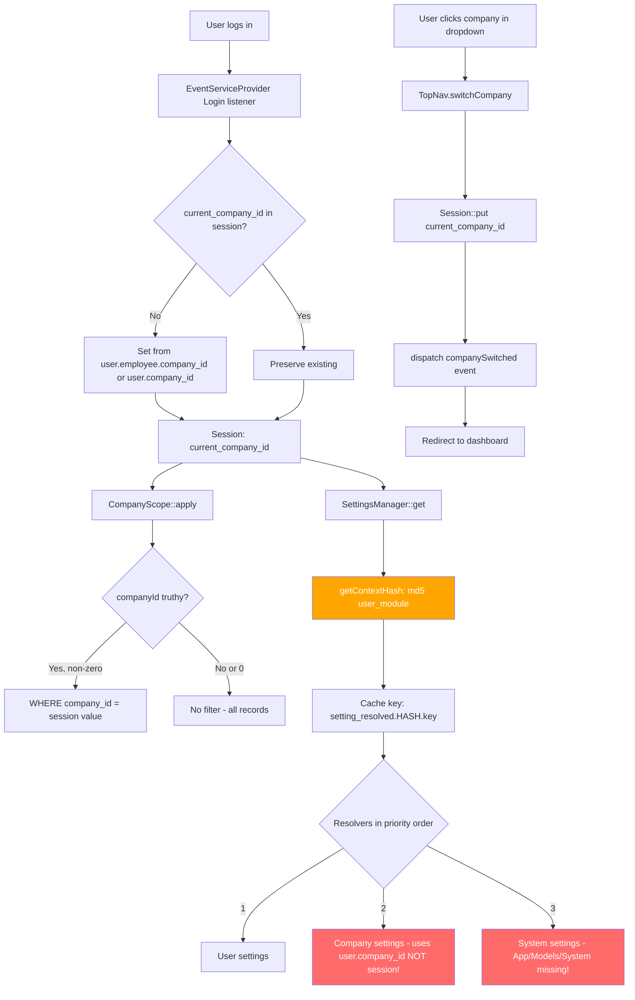

# Company Switcher & Settings Company-Awareness Analysis

**Date**: 2026-07-17  
**Status**: Analysis Complete — No Code Changes Made

---

## 1. Session Key for Active Company

The exact session key is **`current_company_id`**.

| File | Line | Usage |
|------|------|-------|
| [`vendor/quicker-faster/ui-library/src/Http/Livewire/Layouts/Navs/TopNav.php`](vendor/quicker-faster/ui-library/src/Http/Livewire/Layouts/Navs/TopNav.php:115) | 115 | `Session::put('current_company_id', $companyId)` |
| [`app/Providers/EventServiceProvider.php`](app/Providers/EventServiceProvider.php:55) | 55 | `Session::put('current_company_id', $companyId)` (on login) |
| [`app/Modules/Admin/Scopes/CompanyScope.php`](app/Modules/Admin/Scopes/CompanyScope.php:20) | 20 | `Session::get('current_company_id')` |
| [`app/Modules/Admin/Services/AuthorizationService.php`](app/Modules/Admin/Services/AuthorizationService.php:459) | 459 | `session()->get('current_company_id')` |

**Special value**: `0` means "All Companies" (no filtering).

---

## 2. How the Company Switcher Updates It

The company switcher is implemented in the **TopNav** Livewire component:

[`vendor/quicker-faster/ui-library/src/Http/Livewire/Layouts/Navs/TopNav.php`](vendor/quicker-faster/ui-library/src/Http/Livewire/Layouts/Navs/TopNav.php)

### Initialization (`loadCompanies()`, lines 45–102)

1. Checks `config('quicker-faster-ui.multitenancy.switcher_roles')` to determine if the user can see the switcher
2. Loads companies: super admins see all companies; company admins see only their own
3. Reads `Session::get('current_company_id')` to determine the current selection
4. Falls back to defaults if no session value exists:
   - `super_admin` → `0` (All Companies)
   - `company_admin` → their first company's ID

### Switching (`switchCompany()`, lines 107–123)

```php
public function switchCompany(int $companyId): void
{
    // Validates company exists (or is 0 for "All Companies")
    $this->currentCompanyId = $companyId;
    Session::put('current_company_id', $companyId);
    $this->updateCurrentCompanyName();
    
    // Dispatches event for other components to react
    $this->dispatch('companySwitched', companyId: $companyId);
    
    // Redirects to dashboard to refresh page context
    $this->redirect(url('/' . strtolower($this->moduleName) . '/dashboard'));
}
```

### On Login ([`EventServiceProvider`](app/Providers/EventServiceProvider.php:31-58))

The `Login` event listener initializes `current_company_id` on first login if not already set:
- Users with `all_companies_roles` default to `0` (All Companies) if `default_mode` is `'all'`
- Otherwise, derives from `$user->employee->company_id` or `$user->company_id`

---

## 3. How HasCompanyScope Resolves Company Context

### The Trait: [`app/Modules/Admin/Traits/HasCompanyScope.php`](app/Modules/Admin/Traits/HasCompanyScope.php)

Simply registers the `CompanyScope` global scope on model boot:

```php
protected static function bootHasCompanyScope(): void
{
    static::addGlobalScope(new CompanyScope());
}
```

### The Scope: [`app/Modules/Admin/Scopes/CompanyScope.php`](app/Modules/Admin/Scopes/CompanyScope.php)

```php
public function apply(Builder $builder, Model $model): void
{
    $companyId = Session::get('current_company_id');
    if ($companyId) {
        $table = $model->getTable();
        $builder->where("{$table}.company_id", $companyId);
    }
}
```

**Key behavior**:
- When `current_company_id` is **set and non-zero**: filters all queries by that `company_id`
- When `current_company_id` is **0** (All Companies) or **not set**: **no filtering** — all records visible
- Bypass available via `Model::withoutCompanyScope()->get()`

### AuthorizationService: [`app/Modules/Admin/Services/AuthorizationService.php`](app/Modules/Admin/Services/AuthorizationService.php:456-472)

The `getUserCompanyId()` method resolves the effective company per role:
- `super_admin` → `session()->get('current_company_id')` (can be `0` = all)
- `company_admin` → `$user->company_id` (their own company)
- `employee`/`manager` → `$user->employee->company_id`

---

## 4. SettingsManager Cache Keys — NOT Scoped to Active Company

### [`vendor/quicker-faster/ui-library/src/Services/Settings/SettingsManager.php`](vendor/quicker-faster/ui-library/src/Services/Settings/SettingsManager.php)

```php
protected function getCacheKey(string $key): string
{
    $context = $this->getContextHash();
    return "setting_resolved.{$context}.{$key}";
}

protected function getContextHash(): string
{
    $userId = auth()->id() ?? 'guest';
    $module = request()->route('module') ?? session('active_module') ?? 'system';
    return md5($userId . '_' . $module);
}
```

**The cache key includes**: `user_id` + `module`  
**The cache key does NOT include**: `current_company_id` from session

This means if a super_admin switches companies, the cached resolved setting value **does not change** — the cache is scoped only to user+module, not to the active company context.

### HasSettings Trait Cache: [`vendor/quicker-faster/ui-library/src/Traits/HasSettings.php`](vendor/quicker-faster/ui-library/src/Traits/HasSettings.php:43-46)

```php
protected function getSettingCacheKey(string $key): string
{
    return "setting.{$this->getMorphClass()}.{$this->id}.{$key}";
}
```

This is per-model-instance (e.g., `setting.Company.5.timezone`), so it's naturally company-scoped. **No issue here.**

---

## 5. Settings Resolver Chain — Uses User's Own Company, NOT Session Company

### [`vendor/quicker-faster/ui-library/src/Providers/UILibraryServiceProvider.php`](vendor/quicker-faster/ui-library/src/Providers/UILibraryServiceProvider.php:144-172)

```php
private function registerSettingsResolver()
{
    $this->app->singleton(SettingsManager::class, function ($app) {
        $manager = new SettingsManager();

        // Priority 1: User preferences
        $manager->addResolver('user', function ($key) {
            return auth()->user()?->getSetting($key);
        });

        // Priority 2: Account/Company settings  ← BUG HERE
        $manager->addResolver('company', function ($key) {
            $companyId = auth()->user()?->company_id;  // ← Uses user's OWN company_id
            if ($companyId) {
                $company = \App\Modules\Hr\Models\Company::find($companyId);
                return $company?->getSetting($key);
            }
            return null;
        });

        // Priority 3: System defaults
        $manager->addResolver('system', function ($key) {
            $system = \App\Models\System::find(1);
            return $system?->getSetting($key);
        });

        return $manager;
    });
}
```

**Critical Bug**: The `company` resolver uses `auth()->user()?->company_id` — the user's **own** company assignment — instead of `Session::get('current_company_id')`. This means:

| Scenario | Expected | Actual |
|----------|----------|--------|
| Super admin switches to Company A (id=5) | Settings from Company 5 | Settings from super admin's own `company_id` (likely null → falls to system) |
| Company admin (company_id=3) | Settings from Company 3 | Settings from Company 3 ✅ (coincidentally correct) |

### SettingsPanel::getSettableModel(): [`vendor/quicker-faster/ui-library/src/Http/Livewire/Settings/SettingsPanel.php`](vendor/quicker-faster/ui-library/src/Http/Livewire/Settings/SettingsPanel.php:99-109)

Same issue — when `mode === 'company'`, it uses `auth()->user()?->company_id` instead of the session:

```php
protected function getSettableModel()
{
    if ($this->mode === 'company') {
        $companyId = auth()->user()?->company_id;  // ← BUG
        return $companyId ? \App\Modules\Hr\Models\Company::find($companyId) : System::find(1);
    }
    // ...
}
```

---

## 6. Summary of Issues & Required Changes

### Issue 1: SettingsManager Cache Key Missing Company Context

**File**: [`vendor/quicker-faster/ui-library/src/Services/Settings/SettingsManager.php`](vendor/quicker-faster/ui-library/src/Services/Settings/SettingsManager.php:51-57)

**Problem**: `getContextHash()` only includes `user_id` + `module`. When a super_admin switches companies, the cached resolved value is stale.

**Fix needed**: Add `Session::get('current_company_id', 'none')` to the context hash:

```php
protected function getContextHash(): string
{
    $userId = auth()->id() ?? 'guest';
    $module = request()->route('module') ?? session('active_module') ?? 'system';
    $companyId = Session::get('current_company_id', 'none');
    return md5($userId . '_' . $module . '_' . $companyId);
}
```

### Issue 2: Company Resolver Uses Wrong Company ID

**File**: [`vendor/quicker-faster/ui-library/src/Providers/UILibraryServiceProvider.php`](vendor/quicker-faster/ui-library/src/Providers/UILibraryServiceProvider.php:155-162)

**Problem**: The `company` resolver uses `auth()->user()?->company_id` (the user's own company) instead of the session's `current_company_id`.

**Fix needed**: Use `Session::get('current_company_id')`:

```php
$manager->addResolver('company', function ($key) {
    $companyId = Session::get('current_company_id');
    if ($companyId && $companyId !== 0) {
        $company = \App\Modules\Hr\Models\Company::find($companyId);
        return $company?->getSetting($key);
    }
    return null;
});
```

### Issue 3: SettingsPanel::getSettableModel() Uses Wrong Company ID

**File**: [`vendor/quicker-faster/ui-library/src/Http/Livewire/Settings/SettingsPanel.php`](vendor/quicker-faster/ui-library/src/Http/Livewire/Settings/SettingsPanel.php:99-109)

**Problem**: Same as Issue 2 — uses `auth()->user()?->company_id` instead of session.

**Fix needed**: Use `Session::get('current_company_id')` when `mode === 'company'`.

### Issue 4: Missing `App\Models\System` Model

**Files**: 
- [`vendor/quicker-faster/ui-library/src/Providers/UILibraryServiceProvider.php`](vendor/quicker-faster/ui-library/src/Providers/UILibraryServiceProvider.php:166)
- [`vendor/quicker-faster/ui-library/src/Http/Livewire/Settings/SettingsPanel.php`](vendor/quicker-faster/ui-library/src/Http/Livewire/Settings/SettingsPanel.php:102)

**Problem**: Both reference `\App\Models\System::find(1)` but no `App\Models\System` class exists. This will throw a runtime error when the system resolver is invoked.

**Fix needed**: Create `app/Models/System.php` extending a base model with `HasSettings` trait, or use a different approach for system-level defaults.

### Issue 5: `companySwitched` Event Not Handled by SettingsPanel

**File**: [`vendor/quicker-faster/ui-library/src/Http/Livewire/Layouts/Navs/TopNav.php`](vendor/quicker-faster/ui-library/src/Http/Livewire/Layouts/Navs/TopNav.php:119)

**Problem**: When the company is switched, `TopNav` dispatches `companySwitched` and redirects. But if `SettingsPanel` is open in a modal/drawer, it won't refresh its values because it doesn't listen for this event.

**Fix needed**: Add a listener in `SettingsPanel` for the `companySwitched` event to reload current values.

---

## 7. Architecture Diagram



---

## 8. Files That Need Changes (Summary)

| # | File | Change |
|---|------|--------|
| 1 | `vendor/quicker-faster/ui-library/src/Services/Settings/SettingsManager.php` | Add `current_company_id` to `getContextHash()` |
| 2 | `vendor/quicker-faster/ui-library/src/Providers/UILibraryServiceProvider.php` | Fix `company` resolver to use `Session::get('current_company_id')` |
| 3 | `vendor/quicker-faster/ui-library/src/Http/Livewire/Settings/SettingsPanel.php` | Fix `getSettableModel()` to use session company; add `companySwitched` listener |
| 4 | `app/Models/System.php` (create) | Create System model with `HasSettings` trait |
