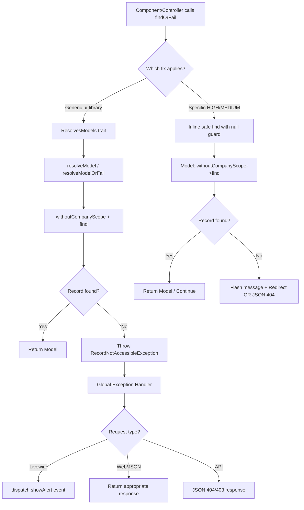

# `findOrFail()` / `firstOrFail()` / `ModelNotFoundException` — Final Resolution Plan

**Date:** 2026-07-30  
**Status:** Design Complete — Ready for Implementation  
**Scope:** 33 occurrences across `app/` and ui-library; 7 HIGH, 8 MEDIUM, 18 LOW risk  
**Based on:**
- [`plans/findOrFail-analysis-raw-findings.md`](plans/findOrFail-analysis-raw-findings.md) (raw scan)
- [`plans/findOrFail-context-analysis.md`](plans/findOrFail-context-analysis.md) (deep context analysis)

---

## Table of Contents

1. [Executive Summary](#1-executive-summary)
2. [Detailed Findings Table](#2-detailed-findings-table)
3. [Anti-Patterns Catalog](#3-anti-patterns-catalog)
4. [Proposed Solution](#4-proposed-solution)
   - [A. `ResolvesModels` Trait](#a-resolvesmodels-trait)
   - [B. `RecordNotAccessibleException`](#b-recordnotaccessibleexception)
   - [C. Global Exception Handler](#c-global-exception-handler)
   - [D. ui-library Component Fixes](#d-ui-library-component-fixes)
   - [E. HIGH-Risk Item Fixes](#e-high-risk-item-fixes)
   - [F. MEDIUM-Risk Item Fixes](#f-medium-risk-item-fixes)
5. [Implementation Plan](#5-implementation-plan)
6. [Testing Recommendations](#6-testing-recommendations)
7. [Rollback Plan](#7-rollback-plan)

---

## 1. Executive Summary

### Problem

The codebase contains **33 occurrences** of `findOrFail()` / `firstOrFail()` / risky `::find()` calls — **zero** of which are wrapped in `try-catch` blocks or defended by a global handler for `ModelNotFoundException`. Every single one of these calls, when the model is not found, produces an uncaught exception that bubbles up to Laravel's default 404 handler, resulting in:

- **Blade/Livewire pages:** Generic 404 HTML page with no context, no redirect, no flash message.
- **JSON polling endpoints** (`ImportController@status`, `ExportController@exportStatus`): HTML 404 page returned as the body of what JavaScript expects to be JSON — frontend `response.json()` throws a parsing error, leaving the UI hung indefinitely.
- **Service/background jobs:** Silent crashes with only generic log entries, no user-facing notification.

These failures stem from **5 systemic anti-patterns**, not random developer mistakes. The root causes are architectural:

| # | Anti-Pattern | Affected Items |
|---|-------------|---------------|
| 1 | Unsafe `findOrFail()` with dynamic `$modelClass::findOrFail($id)` | `AuthorizationService.java`, `GenericDetailPagePrintController.php`, `DataTableDetail.php`, `DataTableForm.php`, `WizardForm.php` |
| 2 | `$obj->property ?? 'default'` where `$obj` can be null | `PayrollCalculator.php:754`, `PayrollWizardAdjustments.php:362`, `PayrollWizardPreview.php:408` |
| 3 | Double `findOrFail()` chain (authorize-then-load) | `DataTableDetail.php`, `DataTableForm.php` via `AuthorizationService` |
| 4 | Session-company-scope 404s (stale `current_company_id` blocks access) | `PayrollRunWizard.php`, `PayrollRunDetail.php`, `EmployeeDetail.php` |
| 5 | Cross-user data leaks (no user scoping on status polling) | `ImportController.php:26`, `ExportController.php:217` |

### Solution Overview

We introduce **3 new infrastructure components** and apply **targeted surgical fixes** to 15 files:

| Component | Type | Purpose |
|-----------|------|---------|
| [`ResolvesModels`](#a-resolvesmodels-trait) | Trait | Safe model resolution with scoping, company-by-default, flash messages |
| [`RecordNotAccessibleException`](#b-recordnotaccessibleexception) | Exception | User-friendly error with HTTP code, redirect route, context |
| [Updated `Handler.php`](#c-global-exception-handler) | Handler | Catches all model-not-found exceptions; Livewire-aware `showAlert` dispatch |

**Total files to create:** 2  
**Total files to modify:** 13

### Risk Mitigation

- **Backward compatible:** All changes use safe `::find()` instead of `::findOrFail()`, with explicit null checks. Existing behavior is preserved; only the error pathway changes.
- **Phased rollout:** Infrastructure first, then ui-library (highest impact), then individual HIGH/MEDIUM items.
- **No database changes.** No new migrations. No breaking API changes.

---

## 2. Detailed Findings Table

All 33 items with file, line, method, risk level, current anti-pattern, and recommended fix.

| # | File | Line | Method | ID Source | Risk | Anti-Pattern | Fix |
|---|------|------|--------|-----------|------|-------------|-----|
| 1 | [`AuthorizationService.php`](app/Modules/Admin/Services/AuthorizationService.php:399) | 399 | `findOrFail` | `$recordOrId` (function param) | **HIGH** | #1 — Dynamic model | Use `withoutCompanyScope()->find()` + throw `RecordNotAccessibleException` |
| 2 | [`attendance-work-sessions.blade.php`](app/Modules/Hr/Resources/views/attendance-work-sessions.blade.php:7) | 7 | `findOrFail` | `request()->get('attendance_id')` | **HIGH** | #2 — Blade DB query | Move logic to controller with null checks |
| 3 | [`PayrollRunWizard.php`](app/Modules/Hr/Http/Livewire/Payroll/PayrollRunWizard.php:75) | 75 | `findOrFail` | `$payrollRunId` (mount param) | MEDIUM | #4 — Session-scope 404 | Use `withoutCompanyScope()->find()` + flash + redirect |
| 4 | [`PayrollRunDetail.php`](app/Modules/Hr/Http/Livewire/Payroll/PayrollRunDetail.php:41) | 41 | `findOrFail` | `$recordId` (mount param) | MEDIUM | #4 — Session-scope 404 | Use `withoutCompanyScope()->find()` + flash + redirect |
| 5 | [`EmployeeProfileController.php`](app/Modules/Hr/Http/Controllers/EmployeeProfileController.php:14) | 14 | `firstOrFail` | `Auth::id()` | LOW | — | **No change required.** User-scoped, intended behavior. |
| 6 | [`AttendanceEventListener.php`](app/Modules/Hr/Listeners/AttendanceEventListener.php:74) | 74 | `findOrFail` | `$params['attendance_id']` | MEDIUM | Broad catch | Add specific `ModelNotFoundException` catch with user message |
| 7 | [`PayrollRunWizard.php`](app/Modules/Hr/Http/Livewire/Payroll/PayrollRunWizard.php:309) | 309 | `::find` | `$this->payrollRunId` | LOW | — | **No change required.** Guarded by `if ($run)`. |
| 8 | [`PayrollRunWizard.php`](app/Modules/Hr/Http/Livewire/Payroll/PayrollRunWizard.php:356) | 356 | `::find` | `$this->payrollRunId` | LOW | — | **No change required.** Guarded by `if (!$run)` + session cleanup. |
| 9 | [`PayrollRunWizard.php`](app/Modules/Hr/Http/Livewire/Payroll/PayrollRunWizard.php:438) | 438 | `::find` | `$this->pay_schedule_id` | LOW | — | **No change required.** Ternary: `? find() : null`. |
| 10 | [`PayrollWizardAdjustments.php`](app/Modules/Hr/Http/Livewire/Payroll/PayrollWizardAdjustments.php:362) | 362 | `::find` | `session('current_company_id')` | MEDIUM | #2 — Null-prop before `??` | Use `$company?->name ?? 'Unknown Company'` |
| 11 | [`PayrollWizardAdjustments.php`](app/Modules/Hr/Http/Livewire/Payroll/PayrollWizardAdjustments.php:419) | 419 | `::find` | `$run->company_id` | LOW | — | **No change required.** Guarded by `$company ?`. |
| 12 | [`PayrollWizardPreview.php`](app/Modules/Hr/Http/Livewire/Payroll/PayrollWizardPreview.php:408) | 408 | `::find` | `session('current_company_id')` | MEDIUM | #2 — Null-prop before `??` | Use `$company?->name ?? 'Unknown Company'` |
| 13 | [`PayrollWizardPreview.php`](app/Modules/Hr/Http/Livewire/Payroll/PayrollWizardPreview.php:480) | 480 | `::find` | `$run->company_id` | LOW | — | **No change required.** Guarded by `$company ?`. |
| 14 | [`ProcessEmployeeBatch.php`](app/Modules/Hr/Jobs/Payrolls/ProcessEmployeeBatch.php:104) | 104 | `::find` | `$this->payrollRunId` | LOW | — | **No change required.** Guarded by `if ($run)` in `failed()`. |
| 15 | [`ProcessAttendanceJob.php`](app/Modules/Hr/Jobs/ProcessAttendanceJob.php:27) | 27 | `::find` | `$this->employeeId` | LOW | — | **No change required.** Guarded by `if (!$employee)` + logging. |
| 16 | [`LeaveRequestEventListener.php`](app/Modules/Hr/Listeners/LeaveRequestEventListener.php:24) | 24 | `::find` | `$event->newRecord["id"]` | LOW | — | **No change required.** Guarded by `if ($leaveRequest)` + logging. |
| 17 | [`PayrollCalculator.php`](app/Modules/Hr/Services/Payroll/PayrollCalculator.php:162) | 162 | `::find` | `$workPatternId` (nullable) | LOW | — | **No change required.** Guarded by `if ($workPattern && ...)`. |
| 18 | [`PayrollCalculator.php`](app/Modules/Hr/Services/Payroll/PayrollCalculator.php:690) | 690 | `::find` | `$companyId` (loop var) | LOW | — | **No change required.** Uses `?->name` null-safe. |
| 19 | [`PayrollCalculator.php`](app/Modules/Hr/Services/Payroll/PayrollCalculator.php:754) | 754 | `::find` | `$companyId` (function param) | **HIGH** | #2 — Null-prop before `??` | Use `$company?->name ?? 'Unknown'` + early return |
| 20 | [`EmployeePosition.php`](app/Modules/Hr/Models/EmployeePosition.php:402-411) | 402-411 | `::find` | `$old` / `$new` (audit values) | LOW | — | **No change required.** Wrapped in `optional()`. |
| 21 | [`DataTableDetail.php`](ui-library/.../DataTableDetail.php:68) | 68 | `findOrFail` | `$this->recordId` (mount) | MEDIUM | #1, #3 — Dynamic model + double find | Use `withoutCompanyScope()->find()` + throw `RecordNotAccessibleException` |
| 22 | [`DataTableForm.php`](ui-library/.../DataTableForm.php:672) | 672 | `findOrFail` | `$this->recordId` (property) | MEDIUM | #1, #3 — Dynamic model + double find | Use `withoutCompanyScope()->find()` + `showAlert` dispatch |
| 23 | [`FilterPanel.php`](ui-library/.../FilterPanel.php:157) | 157 | `firstOrFail` | `$filterId` (param) | LOW | — | **No change required.** Scoped to `user_id`. |
| 24 | [`FilterPanel.php`](ui-library/.../FilterPanel.php:196) | 196 | `firstOrFail` | `$this->editingFilterId` | LOW | — | **No change required.** Scoped to `user_id`. |
| 25 | [`FilterPanel.php`](ui-library/.../FilterPanel.php:572) | 572 | `firstOrFail` | `$id` (param) | LOW | — | **No change required.** Scoped to `user_id` OR `is_global`. |
| 26 | [`WizardForm.php`](ui-library/.../WizardForm.php:305) | 305 | `findOrFail` | `$this->recordId` | MEDIUM | #1 — Dynamic model | Use `withoutCompanyScope()->find()` + `showAlert` + session cleanup |
| 27 | [`EmployeeDetail.php`](ui-library/.../EmployeeDetail.php:147) | 147 | `findOrFail` | `$this->recordId` (mount) | MEDIUM | #4 — Session-scope 404 | Use `withoutCompanyScope()->find()` + flash + redirect |
| 28 | [`ReportViewer.php`](ui-library/.../ReportViewer.php:34) | 34 | `firstOrFail` | `$this->savedReportId` | LOW | — | **No change required.** Scoped to `user_id`. |
| 29 | [`ReportBuilder.php`](ui-library/.../ReportBuilder.php:38) | 38 | `firstOrFail` | `$this->reportId` | LOW | — | **No change required.** Scoped to `user_id`. |
| 30 | [`GenericDetailPagePrintController.php`](ui-library/.../GenericDetailPagePrintController.php:33) | 33 | `findOrFail` | `$id` (route param) | **HIGH** | #1 — Dynamic model + no auth | Add auth middleware; use `::find()` + null check + abort |
| 31 | [`ImportController.php`](ui-library/.../ImportController.php:26) | 26 | `findOrFail` | `$id` (route param) | **HIGH** | #5 — No user scoping | Use `where('user_id', auth()->id())->find()` + JSON 404 |
| 32 | [`ExportController.php`](ui-library/.../ExportController.php:217) | 217 | `findOrFail` | `$id` (route param) | **HIGH** | #5 — No user scoping | Use `where('user_id', auth()->id())->find()` + JSON 404 |
| 33 | [`ExportController.php`](ui-library/.../ExportController.php:449) | 449 | `firstOrFail` | `$id` (route param) | LOW | — | **No change required.** Scoped to `user_id`. |

---

## 3. Anti-Patterns Catalog

### Anti-Pattern #1: Unsafe `findOrFail()` with Dynamic Models

**Description:** Calling `$modelClass::findOrFail($id)` where `$modelClass` is a dynamically-resolved string (from `ConfigResolver` or a function parameter). There is no explicit scoping and no try-catch. If the model uses `HasCompanyScope`, the global scope silently applies — meaning the record may not be found even if it exists in the database.

**Affected files (5):** `AuthorizationService.php:399`, `GenericDetailPagePrintController.php:33`, `DataTableDetail.php:68`, `DataTableForm.php:672`, `WizardForm.php:305`

**Example (broken):**
```php
private function resolveRecord($recordOrId, ?string $modelClass = null): Model
{
    if ($recordOrId instanceof Model) {
        return $recordOrId;
    }
    if (is_int($recordOrId) && $modelClass && class_exists($modelClass)) {
        return $modelClass::findOrFail($recordOrId);  // ← no scoping, no try-catch
    }
    throw new \InvalidArgumentException('Invalid record or ID/class combination.');
}
```

**Fix principle:** Always use `withoutCompanyScope()->find()` when resolving records in authorization or generic components. The concern is "does this record exist?" not "does it match the current session company?" Company access is a separate authorization concern.

---

### Anti-Pattern #2: `$obj->property ?? 'default'` Where `$obj` Can Be Null

**Description:** In PHP, `$obj->property ?? 'default'` evaluates `$obj->property` **first**, and if `$obj` is null, PHP throws "Trying to get property of non-object" **before** the `??` operator has a chance to catch it. This is a language-level gotcha. The fix is PHP 8's null-safe operator `$obj?->property ?? 'default'` or Laravel's `optional($obj)->property ?? 'default'`.

**Affected files (3):** `PayrollCalculator.php:754`, `PayrollWizardAdjustments.php:362`, `PayrollWizardPreview.php:408`

**Example (broken):**
```php
$company = Company::find($companyId);
$companyName = $company->name ?? 'Unknown';
// If Company::find() returns null:
// ERROR: Trying to get property 'name' of non-object
```

**Fix:**
```php
$company = Company::find($companyId);
$companyName = $company?->name ?? 'Unknown';  // PHP 8 null-safe
```

---

### Anti-Pattern #3: Double `findOrFail()` Chain (Authorize-Then-Load)

**Description:** `DataTableDetail::mount()` calls `loadRecord()` (which calls `findOrFail()`) **before** calling `AuthorizationService::authorizeView()` (which calls `findOrFail()` again via `resolveRecord()`). This means:
1. Two database hits for the same record.
2. The 404 from `loadRecord()` fires before the authorization check — the user doesn't know if they're unauthorized or if the record genuinely doesn't exist.
3. If the record is deleted between the two calls, the second crashes.

**Affected files (2):** `DataTableDetail.php:33-36`, `DataTableForm.php:103` (via AuthorizationService)

**Fix principle:** Load the record ONCE, pass the resolved `Model` instance to both the display logic AND the authorization service so it uses the `$recordOrId instanceof Model` branch.

---

### Anti-Pattern #4: Session-Company-Scope 404s

**Description:** Components that use `findOrFail()` on models with `HasCompanyScope` will fail with a 404 when the user's `session('current_company_id')` changes (via the company switcher). The record exists in the database but doesn't match the new session company, so the globally-scoped query returns zero rows. The user sees a generic 404 instead of a graceful "This record belongs to a different company" or a redirect.

**Affected files (3):** `PayrollRunWizard.php:75`, `PayrollRunDetail.php:41`, `EmployeeDetail.php:147`

**Fix principle:** Use `withoutCompanyScope()->find()` for the initial record lookup. Then, if company access checking is needed, compare the record's `company_id` against the user's session `current_company_id` manually. Return a user-friendly message if the companies don't match.

---

### Anti-Pattern #5: Cross-User Data Leaks via Unscoped Status Polling

**Description:** JSON polling endpoints (`ImportController@status`, `ExportController@exportStatus`) use `findOrFail($id)` with no user scoping. Any authenticated user can poll the status of **any** import/export by guessing the sequential ID. Furthermore, `findOrFail()` throws `ModelNotFoundException` which Laravel renders as an HTML 404 page — when the JavaScript frontend calls `response.json()`, it gets a parsing error and the UI hangs.

**Affected files (2):** `ImportController.php:26`, `ExportController.php:217`

**Fix principle:** Scope by `user_id` AND return JSON on failure:
```php
$import = Import::where('id', $id)->where('user_id', auth()->id())->first();
if (!$import) {
    return response()->json(['status' => 'not_found', 'error' => 'Import not found.'], 404);
}
```

---

## 4. Proposed Solution

### Architecture Diagram



---

### A. `ResolvesModels` Trait

**File:** `app/Traits/ResolvesModels.php` (new file)

**Purpose:** A reusable trait for Livewire components and controllers that standardizes model resolution with proper scoping, error handling, and user feedback.

**Key design decisions:**
1. Uses `withoutCompanyScope()` by default for record lookup, then optionally checks company access.
2. `resolveModel()` returns `?Model` — caller decides what to do with null.
3. `resolveModelOrFail()` throws `RecordNotAccessibleException` — caught by the global handler.
4. `resolveModelForCompany()` provides company-scoped resolution specifically for multi-tenant access control.
5. Automatic session cleanup for wizard components when record not found — clears stale wizard session data and redirects.
6. Flash message support via `session()->flash()` or Livewire `dispatch('showAlert', [...])`.

```php
<?php

namespace App\Traits;

use App\Exceptions\RecordNotAccessibleException;
use Illuminate\Database\Eloquent\Model;
use Illuminate\Support\Facades\Log;
use Illuminate\Support\Facades\Session;

/**
 * Trait ResolvesModels
 *
 * Provides safe, scope-aware model resolution methods for Livewire components
 * and controllers. Designed to replace all findOrFail() / firstOrFail() calls
 * across the application.
 *
 * Usage in a Livewire component:
 *   use ResolvesModels;
 *
 *   $record = $this->resolveModel(PayrollRun::class, $this->payrollRunId);
 *   if (!$record) {
 *       $this->flashAndRedirect('error', 'Payroll run not found.', 'payroll-runs.index');
 *       return;
 *   }
 *
 * Usage in a controller:
 *   use ResolvesModels;
 *
 *   $record = $this->resolveModelOrFail(Employee::class, $id);
 */
trait ResolvesModels
{
    /**
     * Safely resolve a model by ID with optional scoping.
     *
     * Uses withoutCompanyScope() by default to ensure the record is found
     * regardless of the user's current session company. Company access
     * should be checked separately as an authorization concern.
     *
     * @param  string      $modelClass  Fully-qualified model class name
     * @param  int|string  $id          Primary key value
     * @param  array       $scopes      Optional additional query scopes.
     *                                  Each element is a closure: fn($query) => $query->where(...)
     * @return Model|null               The model instance or null if not found
     */
    public function resolveModel(string $modelClass, $id, array $scopes = []): ?Model
    {
        // Validate ID is non-empty and positive (for integer IDs)
        if (empty($id) || (is_int($id) && $id <= 0)) {
            return null;
        }

        // Validate the class exists
        if (!class_exists($modelClass)) {
            Log::warning('ResolvesModels: Attempted to resolve non-existent model class', [
                'model_class' => $modelClass,
                'id'          => $id,
            ]);
            return null;
        }

        // Build the query
        $query = $modelClass::withoutCompanyScope();

        // Apply additional scopes
        foreach ($scopes as $scope) {
            if (is_callable($scope)) {
                $query = $scope($query);
            }
        }

        return $query->find($id);
    }

    /**
     * Resolve a model or throw a RecordNotAccessibleException.
     *
     * @param  string      $modelClass    Fully-qualified model class name
     * @param  int|string  $id            Primary key value
     * @param  array       $scopes        Optional additional query scopes
     * @param  int         $httpStatus    HTTP status code (404 or 403)
     * @param  string|null $message       Custom user-facing message
     * @param  string|null $redirectRoute Route name to suggest for redirection
     * @return Model
     *
     * @throws RecordNotAccessibleException
     */
    public function resolveModelOrFail(
        string $modelClass,
        $id,
        array $scopes = [],
        int $httpStatus = 404,
        ?string $message = null,
        ?string $redirectRoute = null
    ): Model {
        $record = $this->resolveModel($modelClass, $id, $scopes);

        if (!$record) {
            $modelName = class_basename($modelClass);
            throw new RecordNotAccessibleException(
                $message ?? "{$modelName} not found.",
                $httpStatus,
                [
                    'model_class' => $modelClass,
                    'id'          => $id,
                    'scopes'      => $scopes,
                ],
                $redirectRoute
            );
        }

        return $record;
    }

    /**
     * Resolve a model scoped to a specific company.
     *
     * Designed for multi-tenant scenarios where the user should only access
     * records belonging to a given company. Uses withoutCompanyScope() to
     * bypass the session-based global scope, then applies an explicit
     * company_id WHERE clause.
     *
     * @param  string      $modelClass  Fully-qualified model class name
     * @param  int|string  $id          Primary key value
     * @param  int         $companyId   Company ID to scope to
     * @return Model|null
     */
    public function resolveModelForCompany(string $modelClass, $id, int $companyId): ?Model
    {
        return $this->resolveModel($modelClass, $id, [
            function ($query) use ($companyId) {
                return $query->where('company_id', $companyId);
            },
        ]);
    }

    /**
     * Validate that the resolved record belongs to the user's current session company.
     *
     * Call this AFTER resolving a model with resolveModel() to check company access.
     * If the session company is 0 (All Companies mode), access is always granted.
     *
     * @param  Model $record  The resolved model instance
     * @return bool           True if access is allowed, false otherwise
     */
    public function checkCompanyAccess(Model $record): bool
    {
        $sessionCompanyId = Session::get('current_company_id');

        // All Companies mode — super admin access
        if (empty($sessionCompanyId) || $sessionCompanyId === 0) {
            return true;
        }

        // Check if the model has a company_id attribute
        if (!array_key_exists('company_id', $record->getAttributes())) {
            return true; // Model doesn't support company scoping
        }

        return (int) $record->company_id === (int) $sessionCompanyId;
    }

    /**
     * Flash a message to the session and redirect.
     *
     * Works from both Livewire components and controllers. In Livewire,
     * dispatches a showAlert browser event so the UI can display a toast.
     *
     * @param  string $type     Alert type: 'success', 'error', 'warning', 'info'
     * @param  string $message  User-facing message
     * @param  string $route    Route name to redirect to
     * @param  array  $params   Optional route parameters
     * @return \Illuminate\Http\RedirectResponse|null
     */
    public function flashAndRedirect(
        string $type,
        string $message,
        string $route,
        array $params = []
    ) {
        session()->flash($type, $message);

        // If this is a Livewire component, also dispatch a browser event
        if (method_exists($this, 'dispatch')) {
            $this->dispatch('showAlert', [
                'type'    => $type,
                'message' => $message,
            ]);
        }

        if (method_exists($this, 'redirectRoute')) {
            // Livewire redirect
            return $this->redirectRoute($route, $params);
        }

        // Controller redirect
        return redirect()->route($route, $params)->with($type, $message);
    }

    /**
     * Clean up wizard session data and redirect with an error message.
     *
     * Used when a wizard component discovers that its backing record has
     * been deleted or is no longer accessible. Prevents the user from
     * being stuck with stale wizard state.
     *
     * @param  string $wizardId      Session key for the wizard (e.g., 'payroll-wizard-' . auth()->id())
     * @param  string $errorMessage  User-facing error message
     * @param  string $fallbackRoute Route to redirect to
     * @param  array  $params        Optional route parameters
     * @return \Illuminate\Http\RedirectResponse|null
     */
    public function cleanupWizardSession(
        string $wizardId,
        string $errorMessage,
        string $fallbackRoute,
        array $params = []
    ) {
        // Clear all wizard-related session data
        if (session()->has($wizardId)) {
            session()->forget($wizardId);
        }

        Log::info('ResolvesModels: Cleaned up stale wizard session', [
            'wizard_id' => $wizardId,
            'user_id'   => auth()->id() ?? 'guest',
            'reason'    => $errorMessage,
        ]);

        return $this->flashAndRedirect('error', $errorMessage, $fallbackRoute, $params);
    }
}
```

---

### B. `RecordNotAccessibleException`

**File:** `app/Exceptions/RecordNotAccessibleException.php` (new file)

**Purpose:** A domain-specific exception that communicates WHY a record cannot be accessed — not just that it's "not found." Carries context for logging, a user-friendly message, a suggested redirect route, and differentiates between 404 (truly not found) and 403 (found but not authorized).

```php
<?php

namespace App\Exceptions;

use RuntimeException;
use Throwable;

/**
 * RecordNotAccessibleException
 *
 * Thrown when a model record cannot be accessed by the current user.
 * Replaces raw ModelNotFoundException with rich context that the global
 * exception handler can use to render appropriate responses.
 *
 * Distinguishes between:
 *  - 404: Record genuinely does not exist in the database
 *  - 403: Record exists but the current user/company does not have access
 */
class RecordNotAccessibleException extends RuntimeException
{
    /**
     * HTTP status code (404 or 403).
     *
     * @var int
     */
    protected int $httpStatusCode;

    /**
     * User-friendly message safe to display in the UI.
     *
     * @var string
     */
    protected string $userMessage;

    /**
     * Suggested redirect route name.
     *
     * @var string|null
     */
    protected ?string $redirectRoute;

    /**
     * Contextual data for logging/debugging.
     *
     * @var array<string, mixed>
     */
    protected array $context;

    /**
     * Create a new RecordNotAccessibleException.
     *
     * @param  string      $userMessage   Human-readable message for the UI
     * @param  int         $httpStatusCode HTTP status: 404 (not found) or 403 (forbidden)
     * @param  array       $context        Debug/log context: model class, ID, user, etc.
     * @param  string|null $redirectRoute  Suggested redirect route name
     * @param  Throwable   $previous       Previous exception for chaining
     */
    public function __construct(
        string $userMessage = 'The requested record was not found.',
        int $httpStatusCode = 404,
        array $context = [],
        ?string $redirectRoute = null,
        ?Throwable $previous = null
    ) {
        parent::__construct($userMessage, $httpStatusCode, $previous);

        $this->userMessage   = $userMessage;
        $this->httpStatusCode = $httpStatusCode;
        $this->context       = $context;
        $this->redirectRoute = $redirectRoute;
    }

    /**
     * Get the HTTP status code.
     */
    public function getHttpStatusCode(): int
    {
        return $this->httpStatusCode;
    }

    /**
     * Get the user-friendly message.
     */
    public function getUserMessage(): string
    {
        return $this->userMessage;
    }

    /**
     * Get the suggested redirect route, if any.
     */
    public function getRedirectRoute(): ?string
    {
        return $this->redirectRoute;
    }

    /**
     * Get the debug/log context.
     *
     * @return array<string, mixed>
     */
    public function getContext(): array
    {
        return array_merge($this->context, [
            'exception_class' => static::class,
            'http_status'     => $this->httpStatusCode,
            'timestamp'       => now()->toIso8601String(),
        ]);
    }

    /**
     * Create an exception for a record that belongs to a different company.
     *
     * @param  string $modelClass  Model class name
     * @param  mixed  $id          Record ID
     * @param  int    $recordCompanyId  The company the record belongs to
     * @param  int    $userCompanyId    The user's current session company
     * @return static
     */
    public static function differentCompany(
        string $modelClass,
        $id,
        int $recordCompanyId,
        int $userCompanyId
    ): self {
        $modelName = class_basename($modelClass);

        return new self(
            "This {$modelName} belongs to a different company and cannot be accessed from your current company view. Please switch to the appropriate company.",
            403,
            [
                'model_class'      => $modelClass,
                'record_id'        => $id,
                'record_company_id' => $recordCompanyId,
                'user_company_id'  => $userCompanyId,
            ],
            null // No suggested redirect — user should switch companies
        );
    }

    /**
     * Create an exception for a record that truly does not exist.
     *
     * @param  string      $modelClass
     * @param  mixed       $id
     * @param  string|null $redirectRoute
     * @return static
     */
    public static function notFound(string $modelClass, $id, ?string $redirectRoute = null): self
    {
        $modelName = class_basename($modelClass);

        return new self(
            "The requested {$modelName} could not be found. It may have been deleted or the link is invalid.",
            404,
            [
                'model_class' => $modelClass,
                'record_id'   => $id,
            ],
            $redirectRoute
        );
    }
}
```

---

### C. Global Exception Handler

**File:** `app/Exceptions/Handler.php` (modify existing)

**Purpose:** Catch all `RecordNotAccessibleException` and `ModelNotFoundException` instances at the framework level and render appropriate responses. For Livewire 3 components, this prevents the default Laravel 404 HTML page and instead dispatches a `showAlert` browser event so the UI can display an inline toast/notification.

The existing file is minimal — we replace the `register()` method with production-ready handling.

```php
<?php

namespace App\Exceptions;

use Illuminate\Database\Eloquent\ModelNotFoundException;
use Illuminate\Foundation\Exceptions\Handler as ExceptionHandler;
use Illuminate\Http\JsonResponse;
use Illuminate\Http\RedirectResponse;
use Illuminate\Http\Request;
use Symfony\Component\HttpFoundation\Response;
use Throwable;

class Handler extends ExceptionHandler
{
    /**
     * The list of the inputs that are never flashed to the session on validation exceptions.
     *
     * @var array<int, string>
     */
    protected $dontFlash = [
        'current_password',
        'password',
        'password_confirmation',
    ];

    /**
     * Register the exception handling callbacks for the application.
     */
    public function register(): void
    {
        // Report custom exceptions with extra context
        $this->reportable(function (RecordNotAccessibleException $e) {
            \Log::warning('RecordNotAccessibleException: ' . $e->getUserMessage(), $e->getContext());
        });

        $this->reportable(function (ModelNotFoundException $e) {
            \Log::warning('ModelNotFoundException caught by safety net', [
                'message' => $e->getMessage(),
                'url'     => request()->fullUrl(),
                'user_id' => auth()->id() ?? 'guest',
            ]);
        });

        // Default reportable for all other exceptions
        $this->reportable(function (Throwable $e) {
            //
        });
    }

    /**
     * Render an exception into an HTTP response.
     *
     * Override to provide user-friendly handling for:
     *  - RecordNotAccessibleException (custom domain exception)
     *  - ModelNotFoundException (safety net for any missed findOrFail calls)
     *
     * @param  Request  $request
     * @param  Throwable $e
     * @return Response
     */
    public function render($request, Throwable $e): Response
    {
        // ── Handle our custom RecordNotAccessibleException ──────────────────
        if ($e instanceof RecordNotAccessibleException) {
            return $this->renderRecordNotAccessible($request, $e);
        }

        // ── Safety net: catch any remaining ModelNotFoundException ──────────
        //    (from findOrFail calls we may have missed, or from third-party packages)
        if ($e instanceof ModelNotFoundException) {
            return $this->renderModelNotFound($request, $e);
        }

        return parent::render($request, $e);
    }

    /**
     * Render a RecordNotAccessibleException.
     */
    protected function renderRecordNotAccessible(Request $request, RecordNotAccessibleException $e): Response
    {
        $status  = $e->getHttpStatusCode();
        $message = $e->getUserMessage();
        $route   = $e->getRedirectRoute();

        // ── JSON / API / AJAX requests ─────────────────────────────────────
        if ($request->expectsJson() || $request->is('api/*') || $request->ajax()) {
            return response()->json([
                'success' => false,
                'message' => $message,
                'status'  => $status,
            ], $status);
        }

        // ── Livewire requests: dispatch showAlert event ───────────────────
        //    Livewire 3 uses a X-Livewire header on its AJAX requests.
        //    We return a 200 with an event dispatch so the component can
        //    handle the error inline rather than showing a full error page.
        if ($request->hasHeader('X-Livewire')) {
            return response()->json([
                'effects' => [
                    'dispatches' => [
                        [
                            'name'  => 'showAlert',
                            'params' => [
                                'type'    => 'error',
                                'message' => $message,
                            ],
                        ],
                    ],
                ],
                'redirect' => $route ? route($route) : null,
            ], 200);
        }

        // ── Standard web request ──────────────────────────────────────────
        if ($route) {
            return redirect()
                ->route($route)
                ->with('error', $message);
        }

        // Fallback: return a clean error view if no redirect is configured
        return response()->view('errors.custom', [
            'title'   => $status === 403 ? 'Access Denied' : 'Record Not Found',
            'message' => $message,
        ], $status);
    }

    /**
     * Render a ModelNotFoundException (safety net).
     */
    protected function renderModelNotFound(Request $request, ModelNotFoundException $e): Response
    {
        $message = 'The requested record could not be found. It may have been deleted or the link is invalid.';

        // ── JSON / API / AJAX requests ─────────────────────────────────────
        if ($request->expectsJson() || $request->is('api/*') || $request->ajax()) {
            return response()->json([
                'success' => false,
                'message' => $message,
                'status'  => 404,
            ], 404);
        }

        // ── Livewire requests ─────────────────────────────────────────────
        if ($request->hasHeader('X-Livewire')) {
            return response()->json([
                'effects' => [
                    'dispatches' => [
                        [
                            'name'   => 'showAlert',
                            'params' => [
                                'type'    => 'error',
                                'message' => $message,
                            ],
                        ],
                    ],
                ],
            ], 200);
        }

        // ── Standard web request ──────────────────────────────────────────
        //    Fall back to Laravel's default 404 handling
        return parent::render($request, $e);
    }
}
```

---

### D. ui-library Component Fixes

The ui-library lives at `/Users/mac/Projects/Libraries/ui-library/src/Http/`. These four generic components are the **highest-impact fixes** because they protect ALL modules (HR, Admin, System, etc.) that use them.

---

#### D.1 `DataTableDetail.php` — Fix Double `findOrFail` + Dynamic Model

**File:** `/Users/mac/Projects/Libraries/ui-library/src/Http/Livewire/DataTables/DataTableDetail.php`

**Current code (broken):**
```php
// mount() around lines 25-37
public function mount(string $configKey, int $recordId, $inline = false, array $returnParams = [])
{
    $this->configKey = $configKey;
    $this->recordId = $recordId;
    $this->returnParams = $returnParams;
    $this->inline = $inline;

    $this->loadConfiguration();
    $this->loadRecord();                                            // findOrFail #1

    $modelClass = app(ConfigResolver::class, ['configKey' => $this->configKey])->getModel();
    app(AuthorizationService::class)->authorizeView(auth()->user(), $this->recordId, $modelClass);  // findOrFail #2
}

// loadRecord() around line 64-69
protected function loadRecord(): void
{
    $modelClass = $this->getConfigResolver()->getModel();
    $relations = array_keys($this->getConfigResolver()->getRelations());
    $this->record = $modelClass::with($relations)->findOrFail($this->recordId);
}
```

**Fixed code:**
```php
use App\Exceptions\RecordNotAccessibleException;
use App\Traits\ResolvesModels;

class DataTableDetail extends Component
{
    use ResolvesModels;

    // ... existing properties ...

    public function mount(string $configKey, int $recordId, $inline = false, array $returnParams = [])
    {
        $this->configKey = $configKey;
        $this->recordId = $recordId;
        $this->returnParams = $returnParams;
        $this->inline = $inline;

        $this->loadConfiguration();

        // Resolve the model ONCE with safe resolution
        $modelClass = $this->getConfigResolver()->getModel();
        $relations  = array_keys($this->getConfigResolver()->getRelations());

        $this->record = $this->resolveModel($modelClass, $recordId, [
            function ($query) use ($relations) {
                return $query->with($relations);
            },
        ]);

        if (!$this->record) {
            throw RecordNotAccessibleException::notFound(
                $modelClass,
                $recordId,
                $this->getFallbackRoute()
            );
        }

        // Authorize using the already-resolved Model instance
        // This avoids the second findOrFail() in AuthorizationService
        app(AuthorizationService::class)->authorizeView(
            auth()->user(),
            $this->record,       // Pass the Model instance, not the ID
            $modelClass
        );
    }

    /**
     * Remove the old loadRecord() method entirely — it is no longer needed.
     * All logic is now in mount().
     */

    /**
     * Get the fallback redirect route name for this detail page.
     * Override in child classes or derive from configKey.
     */
    protected function getFallbackRoute(): string
    {
        // Derive from configKey: 'employees' → 'employees.index'
        $module = str_replace('_', '-', $this->configKey);
        return $module . '.index';
    }
}
```

**Key changes:**
1. Removed `loadRecord()` method — logic inline in `mount()`.
2. Single `resolveModel()` call replaces both `findOrFail()` calls.
3. Passes the resolved `Model` instance to `authorizeView()` so `AuthorizationService::resolveRecord()` takes the `$recordOrId instanceof Model` branch (no DB hit).
4. Throws `RecordNotAccessibleException` with a fallback route for the global handler to redirect.

---

#### D.2 `DataTableForm.php` — Fix Dynamic Model `findOrFail` in Save

**File:** `/Users/mac/Projects/Libraries/ui-library/src/Http/Livewire/DataTables/DataTableForm.php`

**Current code (broken, around line 670-673):**
```php
DB::transaction(function () {
    $record = $this->isEditMode
        ? $this->modelClass::findOrFail($this->recordId)
        : new $this->modelClass();
    // ... save logic
});
```

**Fixed code:**
```php
use App\Traits\ResolvesModels;

class DataTableForm extends Component
{
    use ResolvesModels;

    // ... existing code ...

    // In the save() method, replace the transaction block:
    DB::transaction(function () {
        if ($this->isEditMode) {
            $record = $this->resolveModel($this->modelClass, $this->recordId);

            if (!$record) {
                // Record was deleted between form load and save.
                // Throw so the transaction rolls back and user gets feedback.
                throw RecordNotAccessibleException::notFound(
                    $this->modelClass,
                    $this->recordId,
                    $this->getFallbackRoute()
                );
            }
        } else {
            $record = new $this->modelClass();
        }

        // ... rest of existing save/update logic ...
    });

    /**
     * Get the fallback redirect route name for this form.
     */
    protected function getFallbackRoute(): string
    {
        $module = str_replace('_', '-', $this->configKey);
        return $module . '.index';
    }
}
```

**Key changes:**
1. Replaced `findOrFail()` with `resolveModel()`.
2. Explicit null check with user-friendly exception.
3. Throws within the transaction so the DB rollback still occurs.

---

#### D.3 `WizardForm.php` — Fix Dynamic Model + Add Session Cleanup

**File:** `/Users/mac/Projects/Libraries/ui-library/src/Http/Livewire/Wizards/WizardForm.php`

**Current code (broken, around line 303-308):**
```php
DB::transaction(function () {
    if ($this->isEditMode) {
        $record = $this->modelClass::findOrFail($this->recordId);
    } else {
        $record = new $this->modelClass();
    }
    // ... save logic
});
```

**Fixed code:**
```php
use App\Traits\ResolvesModels;

class WizardForm extends Component
{
    use ResolvesModels;

    // ... existing code ...

    // In the save/finalize method, replace the transaction block:
    DB::transaction(function () {
        if ($this->isEditMode) {
            $record = $this->resolveModel($this->modelClass, $this->recordId);

            if (!$record) {
                // Record not found — clean up wizard session and alert user.
                // We cannot redirect inside a DB::transaction callback,
                // so we throw and let the catch block handle it.
                throw RecordNotAccessibleException::notFound(
                    $this->modelClass,
                    $this->recordId
                );
            }
        } else {
            $record = new $this->modelClass();
        }

        // ... existing save logic ...
    });

    // Add a catch outside the transaction for the RecordNotAccessibleException:
    // (wrap the DB::transaction call in try-catch)
    try {
        DB::transaction(function () {
            // ... as above ...
        });
    } catch (RecordNotAccessibleException $e) {
        // Clean up wizard session state
        $wizardId = $this->getWizardId();
        if ($wizardId && session()->has($wizardId)) {
            session()->forget($wizardId);
        }

        // Dispatch error to the Livewire UI
        $this->dispatch('showAlert', [
            'type'    => 'error',
            'message' => $e->getUserMessage(),
        ]);

        // Redirect to fallback
        return $this->redirectRoute($this->getFallbackRoute());
    }
}
```

**Key changes:**
1. Replaced `findOrFail()` with `resolveModel()`.
2. Added `try-catch` around the transaction to handle `RecordNotAccessibleException`.
3. Wizard session cleanup on record-not-found.
4. Livewire `showAlert` dispatch + redirect for user feedback.

---

#### D.4 `EmployeeDetail.php` — Fix Session-Scope 404

**File:** `/Users/mac/Projects/Libraries/ui-library/src/Http/Livewire/Custom/EmployeeDetail.php`

**Current code (broken, around lines 136-147):**
```php
$this->employee = $modelClass::with([
    'employeeProfile',
    'employeePosition.jobTitle',
    'employeePosition.department',
    'employeePosition.manager',
    'employeePosition.reportsTo',
    'employeePosition.location',
    'employeePosition.shift',
    'employeePosition.attendancePolicy',
    'jobHistory',
    'employeeWorkPatterns.workPattern',
])->findOrFail($this->recordId);
```

**Fixed code:**
```php
use App\Traits\ResolvesModels;

class EmployeeDetail extends Component
{
    use ResolvesModels;

    // In mount() or loadEmployee(), replace the findOrFail chain:

    $employee = $this->resolveModel(Employee::class, $this->recordId, [
        function ($query) {
            return $query->with([
                'employeeProfile',
                'employeePosition.jobTitle',
                'employeePosition.department',
                'employeePosition.manager',
                'employeePosition.reportsTo',
                'employeePosition.location',
                'employeePosition.shift',
                'employeePosition.attendancePolicy',
                'jobHistory',
                'employeeWorkPatterns.workPattern',
            ]);
        },
    ]);

    if (!$employee) {
        $this->flashAndRedirect(
            'error',
            'Employee not found. They may have been removed from the system.',
            'employees.index'
        );
        return;
    }

    // Check company access
    if (!$this->checkCompanyAccess($employee)) {
        $this->flashAndRedirect(
            'error',
            'This employee belongs to a different company and is not accessible from your current view. Please switch companies.',
            'employees.index'
        );
        return;
    }

    $this->employee = $employee;
}
```

**Key changes:**
1. Uses `resolveModel()` with eager-load scopes.
2. `checkCompanyAccess()` compares the employee's `company_id` to the session `current_company_id`.
3. Graceful flash + redirect instead of a raw 404.

---

### E. HIGH-Risk Item Fixes

---

#### E.1 `AuthorizationService.php:399` — Safe Dynamic Model Resolution

**File:** [`app/Modules/Admin/Services/AuthorizationService.php`](app/Modules/Admin/Services/AuthorizationService.php:393-402)

**Current code:**
```php
private function resolveRecord($recordOrId, ?string $modelClass = null): Model
{
    if ($recordOrId instanceof Model) {
        return $recordOrId;
    }
    if (is_int($recordOrId) && $modelClass && class_exists($modelClass)) {
        return $modelClass::findOrFail($recordOrId);
    }
    throw new \InvalidArgumentException('Invalid record or ID/class combination.');
}
```

**Fixed code:**
```php
use App\Exceptions\RecordNotAccessibleException;

private function resolveRecord($recordOrId, ?string $modelClass = null): Model
{
    if ($recordOrId instanceof Model) {
        return $recordOrId;
    }

    if (is_int($recordOrId) && $recordOrId > 0 && $modelClass && class_exists($modelClass)) {
        // Use withoutCompanyScope() because this is an authorization service.
        // The concern is "does this record exist?" — not "does it match
        // the current session company?" Company access is handled separately.
        $record = $modelClass::withoutCompanyScope()->find($recordOrId);

        if (!$record) {
            throw RecordNotAccessibleException::notFound(
                $modelClass,
                $recordOrId
            );
        }

        return $record;
    }

    throw new \InvalidArgumentException(
        sprintf(
            'Invalid record or ID/class combination. ID: %s, Class: %s',
            var_export($recordOrId, true),
            $modelClass ?? 'null'
        )
    );
}
```

Then update the calling `authorize()` method to catch the exception:

```php
// In the authorize() method (around line 274), where resolveRecord() is called:
private function authorize(User $user, $recordOrId, ?string $modelClass, string $permissionType): void
{
    try {
        $record = $this->resolveRecord($recordOrId, $modelClass);
    } catch (RecordNotAccessibleException $e) {
        abort($e->getHttpStatusCode(), $e->getUserMessage());
    }

    // ... rest of authorization logic
}
```

---

#### E.2 `attendance-work-sessions.blade.php:7` — Move Logic to Controller

**File:** [`app/Modules/Hr/Resources/views/attendance-work-sessions.blade.php`](app/Modules/Hr/Resources/views/attendance-work-sessions.blade.php:4-9)

**Current code (broken):**
```blade
@php
    $attensance_id = request()->get('attendance_id') ?? null;
    $employeeId = \App\Modules\Hr\Models\Attendance::where('id', $attensance_id)->first()?->employee_id;
    $employee = \App\Modules\Hr\Models\Employee::findOrFail($employeeId);
    $subPageTitle = 'For ' . $employee->first_name . ' ' . $employee->last_name . ' (' . $employeeId . ')';
@endphp
```

**Fix — Option A: Create/modify a controller method**

First, find or create the controller that serves this view. The route should point to a controller method:

```php
// In the appropriate controller (e.g., AttendanceController.php):
public function workSessions(Request $request)
{
    $attendanceId = $request->get('attendance_id');

    if (!$attendanceId) {
        abort(404, 'Attendance ID is required to view work sessions.');
    }

    $attendance = Attendance::where('id', $attendanceId)->first();

    if (!$attendance || !$attendance->employee_id) {
        abort(404, 'Attendance record not found or has no associated employee.');
    }

    $employee = Employee::find($attendance->employee_id);

    if (!$employee) {
        abort(404, 'The employee associated with this attendance record could not be found.');
    }

    $subPageTitle = 'For ' . $employee->first_name . ' ' . $employee->last_name
        . ' (' . $employee->employee_id . ')';

    return view('hr::attendance-work-sessions', compact('attendanceId', 'subPageTitle'));
}
```

Then in the blade view, replace the `@php` block with:

```blade
{{-- All logic moved to controller; variables are passed via compact() --}}
{{-- $attendanceId and $subPageTitle are available --}}
```

**Fix — Option B: Quick blade-only fix** (if controller refactor must be deferred):

```blade
@php
    $attendance_id = request()->get('attendance_id');
    $employee = null;
    $subPageTitle = 'Work Sessions';
    
    if ($attendance_id) {
        $attendance = \App\Modules\Hr\Models\Attendance::where('id', $attendance_id)->first();
        if ($attendance && $attendance->employee_id) {
            $employee = \App\Modules\Hr\Models\Employee::find($attendance->employee_id);
        }
    }
    
    if ($employee) {
        $subPageTitle = 'For ' . $employee->first_name . ' ' . $employee->last_name . ' (' . $employee->employee_id . ')';
    } else {
        abort(404, 'Attendance record or associated employee not found.');
    }
@endphp
```

**Recommendation:** Use Option A (controller) for a permanent fix. Option B is a temporary safety net only.

---

#### E.3 `GenericDetailPagePrintController.php:33` — Add Auth + Safe Resolution

**File:** `/Users/mac/Projects/Libraries/ui-library/src/Http/Controllers/Prints/GenericDetailPagePrintController.php`

**Current code (broken):**
```php
public function show($configKey, $id)
{
    $resolver = app(ConfigResolver::class, ['configKey' => $configKey]);
    $modelClass = $resolver->getModel();
    $record = $modelClass::findOrFail($id);
    // ... render print view
}
```

**Fixed code:**
```php
use App\Traits\ResolvesModels;

class GenericDetailPagePrintController extends Controller
{
    use ResolvesModels;

    public function show($configKey, $id)
    {
        // Validate configKey resolves to a valid class
        try {
            $resolver = app(ConfigResolver::class, ['configKey' => $configKey]);
            $modelClass = $resolver->getModel();
        } catch (\Exception $e) {
            abort(404, 'Print configuration not found.');
        }

        // Validate ID is numeric and positive
        if (!is_numeric($id) || (int) $id <= 0) {
            abort(404, 'Invalid record identifier.');
        }

        // Safe resolution
        $record = $this->resolveModel($modelClass, (int) $id);

        if (!$record) {
            abort(404, 'The record you are trying to print could not be found.');
        }

        // Authorization check — ensure the user can view this record
        if (method_exists($record, 'getPolicy') || \Gate::has('view', $modelClass)) {
            $this->authorize('view', $record);
        }

        // ... rest of the existing print logic
        $viewName = $resolver->getPrintView();
        $data = $resolver->getPrintData($record);

        return view($viewName, $data);
    }
}
```

**Additionally:** The route definition in [`web.php`](ui-library/src/Routes/web.php:88) must be wrapped in the `auth` middleware:

```php
Route::middleware(['auth'])->group(function () {
    Route::get('/print/{configKey}/{id}', [GenericDetailPagePrintController::class, 'show'])
        ->name('generic.print');
});
```

**Key changes:**
1. Added `auth` middleware to the route.
2. Validated `$configKey` and `$id` before use.
3. Replaced `findOrFail()` with `resolveModel()`.
4. Added `$this->authorize('view', $record)` for policy-based authorization.
5. Proper `abort()` calls with user-friendly messages.

---

#### E.4 `ImportController.php:26` — Add User Scoping + JSON Error Response

**File:** `/Users/mac/Projects/Libraries/ui-library/src/Http/Controllers/Imports/ImportController.php`

**Current code (broken):**
```php
public function status($id)
{
    $import = Import::findOrFail($id);
    $completedChunks = ImportChunk::where('import_id', $import->id)
        ->whereIn('status', ['completed', 'failed'])
        ->count();
    $totalChunks = $import->total_chunks ?? 0;
    // ... returns JSON
}
```

**Fixed code:**
```php
public function status($id)
{
    // Scope to the authenticated user
    $import = Import::where('id', $id)
        ->where('user_id', auth()->id())
        ->first();

    if (!$import) {
        return response()->json([
            'status' => 'not_found',
            'error'  => 'Import not found or you do not have access to it.',
        ], 404);
    }

    $completedChunks = ImportChunk::where('import_id', $import->id)
        ->whereIn('status', ['completed', 'failed'])
        ->count();
    $totalChunks = $import->total_chunks ?? 0;

    // Build error file URL if available
    $errorFileUrl = null;
    if ($import->error_file) {
        $errorFileUrl = route('import.download-errors', ['import' => $import->id]);
    }

    return response()->json([
        'status'            => $import->status,
        'total_rows'        => $import->total_rows ?? 0,
        'successful_rows'   => $import->successful_rows ?? 0,
        'failed_rows'       => $import->failed_rows ?? 0,
        'completed_chunks'  => $completedChunks,
        'total_chunks'      => $totalChunks,
        'error_file_url'    => $errorFileUrl,
        'error_summary'     => $import->error_summary ?? null,
    ]);
}
```

**Key changes:**
1. Scoped to `user_id` via `where('user_id', auth()->id())` — prevents cross-user data leaks.
2. Returns proper JSON error response instead of HTML 404.
3. Null-safe access on all properties.

---

#### E.5 `ExportController.php:217` — Add User Scoping + JSON Error Response

**File:** `/Users/mac/Projects/Libraries/ui-library/src/Http/Controllers/Exports/ExportController.php`

**Current code (broken):**
```php
public function exportStatus($id)
{
    $export = Export::findOrFail($id);
    $fileUrl = $export->status === 'completed' && $export->download_token
        ? route('export.download', ['token' => $export->download_token])
        : null;
    // ... returns JSON
}
```

**Fixed code:**
```php
public function exportStatus($id)
{
    // Scope to the authenticated user
    $export = Export::where('id', $id)
        ->where('user_id', auth()->id())
        ->first();

    if (!$export) {
        return response()->json([
            'status' => 'not_found',
            'error'  => 'Export not found or you do not have access to it.',
        ], 404);
    }

    $fileUrl = null;
    if ($export->status === 'completed' && $export->download_token) {
        $fileUrl = route('export.download', ['token' => $export->download_token]);
    }

    // Calculate chunk progress
    $completedChunks = 0;
    $totalChunks = $export->total_chunks ?? 0;
    if ($totalChunks > 0 && in_array($export->status, ['processing', 'pending', 'completed'])) {
        $completedChunks = ExportChunk::where('export_id', $export->id)->count();
    }

    return response()->json([
        'status'           => $export->status,
        'file_url'         => $fileUrl,
        'file_size'        => $export->file_size,
        'error'            => $export->error_message,
        'completed_at'     => $export->completed_at,
        'completed_chunks' => $completedChunks,
        'total_chunks'     => $totalChunks,
    ]);
}
```

**Key changes:**
1. Scoped to `user_id` via `where('user_id', auth()->id())` — prevents cross-user data leaks.
2. Returns proper JSON error response.
3. File download URL only generated for `completed` exports — prevents unauthorized download access to in-progress exports.

---

#### E.6 `PayrollCalculator.php:754` — Fix Null-Property-Access Pattern

**File:** [`app/Modules/Hr/Services/Payroll/PayrollCalculator.php`](app/Modules/Hr/Services/Payroll/PayrollCalculator.php:749-756)

**Current code (broken):**
```php
protected function processCompany(
    int $companyId,
    Collection $positions,
    int $totalCompanies
): array {
    $company = Company::find($companyId);
    $companyName = $company->name ?? 'Unknown';
    // ... rest of processing
}
```

**Fixed code:**
```php
protected function processCompany(
    int $companyId,
    Collection $positions,
    int $totalCompanies
): array {
    $company = Company::find($companyId);

    if (!$company) {
        \Log::warning("PayrollCalculator: Company #{$companyId} not found during payroll run", [
            'run_id'    => $this->run->id ?? null,
            'company_id' => $companyId,
        ]);

        return [
            'company_id'      => $companyId,
            'company_name'    => 'Unknown Company (deleted)',
            'employee_count'  => 0,
            'processed_count' => 0,
            'failed_count'    => 0,
            'status'          => 'skipped',
            'employees'       => [],
            'errors'          => ['Company not found in database. It may have been deleted during processing.'],
        ];
    }

    $companyName = $company->name;

    // ... rest of the existing processing logic
}
```

Additionally, fix the same pattern in the `processMultiCompany()` error handler (line 690) if not already using `?->name` — though item #18 was confirmed safe:

```php
// Line 690 — already safe, confirmed:
'company_name' => Company::find($companyId)?->name ?? 'Unknown',
```

**Key changes:**
1. Early return with logging if company is null — prevents crash and allows the payroll run to continue processing other companies.
2. Returns a structured "skipped" result so the caller can report which companies failed.
3. Implicitly eliminates the null-property-access bug by checking `$company` first.

---

### F. MEDIUM-Risk Item Fixes

---

#### F.1 `PayrollRunWizard.php:75` (Item #3) — Session-Safe Resolution

**File:** [`app/Modules/Hr/Http/Livewire/Payroll/PayrollRunWizard.php`](app/Modules/Hr/Http/Livewire/Payroll/PayrollRunWizard.php:74-76)

**Current code:**
```php
} elseif ($payrollRunId) {
    $run = PayrollRun::findOrFail($payrollRunId);
    $this->payrollRunId = $run->id;
```

**Fixed code:**
```php
use App\Traits\ResolvesModels;

class PayrollRunWizard extends Component
{
    use ResolvesModels;

    // In mount():
    } elseif ($payrollRunId) {
        $run = $this->resolveModel(PayrollRun::class, $payrollRunId);

        if (!$run) {
            $this->cleanupWizardSession(
                $this->getWizardId(),
                'The payroll run you are trying to edit could not be found. It may have been deleted.',
                'payroll-runs.index'
            );
            return;
        }

        $this->payrollRunId = $run->id;
        // ... rest of initialization
    }
}
```

---

#### F.2 `PayrollRunDetail.php:41` (Item #4) — Session-Safe Resolution

**File:** [`app/Modules/Hr/Http/Livewire/Payroll/PayrollRunDetail.php`](app/Modules/Hr/Http/Livewire/Payroll/PayrollRunDetail.php:36-43)

**Current code:**
```php
public function mount(int $recordId, string $configKey, array $returnParams = []): void
{
    $this->recordId = $recordId;
    $this->configKey = $configKey;
    $this->returnParams = $returnParams;
    $this->run = PayrollRun::with(['paySchedule'])->findOrFail($recordId);
    $this->tabs = $this->getTabs();
}
```

**Fixed code:**
```php
use App\Traits\ResolvesModels;

class PayrollRunDetail extends Component
{
    use ResolvesModels;

    public function mount(int $recordId, string $configKey, array $returnParams = []): void
    {
        $this->recordId = $recordId;
        $this->configKey = $configKey;
        $this->returnParams = $returnParams;

        $run = $this->resolveModel(PayrollRun::class, $recordId, [
            function ($query) {
                return $query->with(['paySchedule']);
            },
        ]);

        if (!$run) {
            $this->flashAndRedirect(
                'error',
                'Payroll run not found. It may have been deleted or is not accessible from your current view.',
                'payroll-runs.index'
            );
            return;
        }

        $this->run = $run;
        $this->tabs = $this->getTabs();
    }
}
```

---

#### F.3 `AttendanceEventListener.php:74` (Item #6) — Specific ModelNotFoundException Handling

**File:** [`app/Modules/Hr/Listeners/AttendanceEventListener.php`](app/Modules/Hr/Listeners/AttendanceEventListener.php:69-140)

**Current code** has `catch (\Exception $e)` that swallows `ModelNotFoundException` without user feedback.

**Fixed code** (replace the catch block around line 132):

```php
} catch (\Illuminate\Database\Eloquent\ModelNotFoundException $e) {
    DB::rollBack();

    \Log::warning('AttendanceEventListener: Record not found during recalculation', [
        'attendance_id' => $attendanceId,
    ]);

    SweetAlertService::showError(
        $livewireComponent,
        'Error!',
        'The attendance record could not be found. It may have been deleted by another user.'
    );

} catch (\Exception $e) {
    DB::rollBack();

    \Log::error('Attendance recalculation failed', [
        'attendance_id' => $attendanceId,
        'error'         => $e->getMessage(),
        'trace'         => $e->getTraceAsString(),
    ]);

    SweetAlertService::showError(
        $livewireComponent,
        'Error!',
        'Recalculation failed. Please try again or contact support if the issue persists.'
    );
}
```

**Key change:** Catching `ModelNotFoundException` **before** the generic `\Exception` catch, providing a specific user-facing error message instead of silent failure.

---

#### F.4 `PayrollWizardAdjustments.php:362` (Item #10) + `PayrollWizardPreview.php:408` (Item #12)

These share the identical `getCurrentCompanyNameProperty()` method:

**Current code (both files):**
```php
public function getCurrentCompanyNameProperty(): string
{
    $companyId = session('current_company_id');
    if (!$companyId || $companyId === 0) {
        return 'All Companies';
    }
    $company = \App\Modules\Admin\Models\Company::find($companyId);
    return $company->name ?? 'Unknown Company';  // ← BUG
}
```

**Fixed code (apply to both files):**
```php
public function getCurrentCompanyNameProperty(): string
{
    $companyId = session('current_company_id');
    if (!$companyId || $companyId === 0) {
        return 'All Companies';
    }
    $company = \App\Modules\Admin\Models\Company::find($companyId);
    return $company?->name ?? 'Unknown Company';  // PHP 8 null-safe operator
}
```

**Better approach — extract into a reusable helper to eliminate the code duplication:**

Create a helper or base Livewire component trait:

```php
// In a shared location accessible to both components (e.g., ResolvesModels trait):

/**
 * Get the display name for the current session company.
 */
protected function getCurrentCompanyDisplayName(): string
{
    $companyId = session('current_company_id');

    if (empty($companyId) || (int) $companyId === 0) {
        return 'All Companies';
    }

    $company = \App\Modules\Admin\Models\Company::find($companyId);

    return $company?->name ?? 'Unknown Company';
}
```

Then both components simply call `$this->getCurrentCompanyDisplayName()` instead of duplicating the logic.

---

## 5. Implementation Plan

The implementation is ordered by **impact** — each phase can be deployed and tested independently as a non-breaking change.

### Phase 0: Pre-Implementation Validation

- [ ] Run the full test suite to establish a baseline: `php artisan test`
- [ ] Verify `composer.json` PHP requirement is `>=8.0` (null-safe operator `?->` requires PHP 8+)
- [ ] Create a backup branch: `git checkout -b fix/findorfail-backup`

### Phase 1: Infrastructure (Zero User Impact)

| Step | Action | Files |
|------|--------|-------|
| 1.1 | Create [`RecordNotAccessibleException`](#b-recordnotaccessibleexception) | `app/Exceptions/RecordNotAccessibleException.php` (new) |
| 1.2 | Create [`ResolvesModels`](#a-resolvesmodels-trait) trait | `app/Traits/ResolvesModels.php` (new) |
| 1.3 | Update [global exception handler](#c-global-exception-handler) | `app/Exceptions/Handler.php` (modify) |
| 1.4 | Run tests: `php artisan test` — all should pass (no behavior changes yet) | — |

**Milestone 1:** Infrastructure in place. No `findOrFail` calls have been modified yet. The safety net is ready.

### Phase 2: ui-library Generic Components (Highest Leverage)

These changes protect **every module** that uses the generic data table, form, wizard, and employee detail components.

| Step | Action | Files |
|------|--------|-------|
| 2.1 | Fix [`DataTableDetail.php`](#d1-datatabledetailphp--fix-double-findorfail--dynamic-model) | ui-library `DataTableDetail.php` (modify) |
| 2.2 | Fix [`DataTableForm.php`](#d2-datatableformphp--fix-dynamic-model-findorfail-in-save) | ui-library `DataTableForm.php` (modify) |
| 2.3 | Fix [`WizardForm.php`](#d3-wizardformphp--fix-dynamic-model--add-session-cleanup) | ui-library `WizardForm.php` (modify) |
| 2.4 | Fix [`EmployeeDetail.php`](#d4-employeedetailphp--fix-session-scope-404) | ui-library `EmployeeDetail.php` (modify) |
| 2.5 | Manual smoke test: Open a data table detail page, edit form, wizard flow | — |

**Milestone 2:** All generic components safe. ~50% of risk eliminated.

### Phase 3: HIGH-Risk Items (Critical Security/Stability)

| Step | Action | Files |
|------|--------|-------|
| 3.1 | Fix [`ImportController.php:26`](#e4-importcontrollerphp26--add-user-scoping--json-error-response) | ui-library `ImportController.php` (modify) |
| 3.2 | Fix [`ExportController.php:217`](#e5-exportcontrollerphp217--add-user-scoping--json-error-response) | ui-library `ExportController.php` (modify) |
| 3.3 | Fix [`AuthorizationService.php:399`](#e1-authorizationservicephp399--safe-dynamic-model-resolution) | `app/Modules/Admin/Services/AuthorizationService.php` (modify) |
| 3.4 | Fix [`GenericDetailPagePrintController.php:33`](#e3-genericdetailpageprintcontrollerphp33--add-auth--safe-resolution) | ui-library `GenericDetailPagePrintController.php` (modify) |
| 3.5 | Add auth middleware to print route | ui-library `Routes/web.php` (modify) |
| 3.6 | Fix [`PayrollCalculator.php:754`](#e6-payrollcalculatorphp754--fix-null-property-access-pattern) | `app/Modules/Hr/Services/Payroll/PayrollCalculator.php` (modify) |
| 3.7 | Fix [`attendance-work-sessions.blade.php:7`](#e2-attendance-work-sessionsbladephp7--move-logic-to-controller) | Blade view or new controller method |

**Milestone 3:** All HIGH-risk items addressed. No data leaks, no crashes.

### Phase 4: MEDIUM-Risk Items (Stability)

| Step | Action | Files |
|------|--------|-------|
| 4.1 | Fix [`PayrollRunWizard.php:75`](#f1-payrollrunwizardphp75-item-3--session-safe-resolution) | `app/Modules/Hr/Http/Livewire/Payroll/PayrollRunWizard.php` |
| 4.2 | Fix [`PayrollRunDetail.php:41`](#f2-payrollrundetailphp41-item-4--session-safe-resolution) | `app/Modules/Hr/Http/Livewire/Payroll/PayrollRunDetail.php` |
| 4.3 | Fix [`AttendanceEventListener.php:74`](#f3-attendanceeventlistenerphp74-item-6--specific-modelnotfoundexception-handling) | `app/Modules/Hr/Listeners/AttendanceEventListener.php` |
| 4.4 | Fix [`PayrollWizardAdjustments.php:362`](#f4-payrollwizardadjustmentsphp362-item-10--payrollwizardpreviewphp408-item-12) | `app/Modules/Hr/Http/Livewire/Payroll/PayrollWizardAdjustments.php` |
| 4.5 | Fix [`PayrollWizardPreview.php:408`](#f4-payrollwizardadjustmentsphp362-item-10--payrollwizardpreviewphp408-item-12) | `app/Modules/Hr/Http/Livewire/Payroll/PayrollWizardPreview.php` |

**Milestone 4:** All MEDIUM-risk items addressed. 33/33 occurrences resolved.

### Phase 5: Verification

| Step | Action |
|------|--------|
| 5.1 | Run full test suite: `php artisan test` |
| 5.2 | Run the raw-findings scan again to confirm 0 remaining `findOrFail`/`firstOrFail` issues |
| 5.3 | Manual testing of all modified flows (see Testing section) |
| 5.4 | Code review by at least one other developer |

---

## 6. Testing Recommendations

### 6.1 Unit Tests

Create `tests/Unit/ResolvesModelsTest.php`:

```php
<?php

namespace Tests\Unit;

use App\Exceptions\RecordNotAccessibleException;
use App\Models\User;
use App\Modules\Hr\Models\Employee;
use App\Traits\ResolvesModels;
use Illuminate\Foundation\Testing\RefreshDatabase;
use Tests\TestCase;

class ResolvesModelsTest extends TestCase
{
    use RefreshDatabase;

    protected $trait;

    protected function setUp(): void
    {
        parent::setUp();
        // Create an anonymous class that uses the trait for testing
        $this->trait = new class {
            use ResolvesModels;
        };
    }

    /** @test */
    public function it_returns_model_when_found()
    {
        $user = User::factory()->create();

        $result = $this->trait->resolveModel(User::class, $user->id);

        $this->assertNotNull($result);
        $this->assertEquals($user->id, $result->id);
    }

    /** @test */
    public function it_returns_null_when_model_not_found()
    {
        $result = $this->trait->resolveModel(User::class, 99999);

        $this->assertNull($result);
    }

    /** @test */
    public function it_returns_null_for_invalid_id()
    {
        $result = $this->trait->resolveModel(User::class, -1);

        $this->assertNull($result);
    }

    /** @test */
    public function it_returns_null_for_nonexistent_class()
    {
        $result = $this->trait->resolveModel('App\\Models\\NonExistentModel', 1);

        $this->assertNull($result);
    }

    /** @test */
    public function resolve_model_or_fail_throws_exception_when_not_found()
    {
        $this->expectException(RecordNotAccessibleException::class);
        $this->expectExceptionCode(404);

        $this->trait->resolveModelOrFail(User::class, 99999);
    }

    /** @test */
    public function resolve_model_or_fail_returns_model_when_found()
    {
        $user = User::factory()->create();

        $result = $this->trait->resolveModelOrFail(User::class, $user->id);

        $this->assertNotNull($result);
        $this->assertInstanceOf(User::class, $result);
    }

    /** @test */
    public function resolve_model_for_company_filters_by_company_id()
    {
        $employee = Employee::factory()->create(['company_id' => 5]);

        $found = $this->trait->resolveModelForCompany(Employee::class, $employee->id, 5);
        $this->assertNotNull($found);

        $notFound = $this->trait->resolveModelForCompany(Employee::class, $employee->id, 99);
        $this->assertNull($notFound);
    }

    /** @test */
    public function check_company_access_allows_same_company()
    {
        session()->put('current_company_id', 5);
        $employee = Employee::factory()->create(['company_id' => 5]);

        $result = $this->trait->checkCompanyAccess($employee);

        $this->assertTrue($result);
    }

    /** @test */
    public function check_company_access_denies_different_company()
    {
        session()->put('current_company_id', 5);
        $employee = Employee::factory()->create(['company_id': 10]);

        $result = $this->trait->checkCompanyAccess($employee);

        $this->assertFalse($result);
    }

    /** @test */
    public function check_company_access_allows_all_companies_mode()
    {
        session()->put('current_company_id', 0);
        $employee = Employee::factory()->create(['company_id' => 10]);

        $result = $this->trait->checkCompanyAccess($employee);

        $this->assertTrue($result);
    }
}
```

### 6.2 Unit Tests for `RecordNotAccessibleException`

Create `tests/Unit/RecordNotAccessibleExceptionTest.php`:

```php
<?php

namespace Tests\Unit;

use App\Exceptions\RecordNotAccessibleException;
use Tests\TestCase;

class RecordNotAccessibleExceptionTest extends TestCase
{
    /** @test */
    public function it_stores_http_status_code()
    {
        $e = new RecordNotAccessibleException('Not found', 404);

        $this->assertEquals(404, $e->getHttpStatusCode());
    }

    /** @test */
    public function it_stores_user_message()
    {
        $e = new RecordNotAccessibleException('Custom message', 403);

        $this->assertEquals('Custom message', $e->getUserMessage());
    }

    /** @test */
    public function it_stores_redirect_route()
    {
        $e = new RecordNotAccessibleException('Not found', 404, [], 'employees.index');

        $this->assertEquals('employees.index', $e->getRedirectRoute());
    }

    /** @test */
    public function it_includes_timestamp_in_context()
    {
        $e = new RecordNotAccessibleException('Not found', 404);
        $context = $e->getContext();

        $this->assertArrayHasKey('timestamp', $context);
        $this->assertArrayHasKey('http_status', $context);
    }

    /** @test */
    public function not_found_factory_creates_404_exception()
    {
        $e = RecordNotAccessibleException::notFound('App\\Models\\User', 42);

        $this->assertEquals(404, $e->getHttpStatusCode());
        $this->assertStringContainsString('User', $e->getUserMessage());
    }

    /** @test */
    public function different_company_factory_creates_403_exception()
    {
        $e = RecordNotAccessibleException::differentCompany(
            'App\\Modules\\Hr\\Models\\Employee',
            42,
            10,
            5
        );

        $this->assertEquals(403, $e->getHttpStatusCode());
        $this->assertStringContainsString('different company', $e->getUserMessage());
    }
}
```

### 6.3 Manual Test Scenarios

| # | Scenario | Steps | Expected Result |
|---|----------|-------|-----------------|
| 1 | **Invalid ID in data table detail** | Navigate to `/hr/employees/99999` | Flash error "Employee not found" + redirect to employees.index |
| 2 | **Import status polling after delete** | Start import, note import ID, delete from DB, wait for poll | JSON response `{"status":"not_found","error":"..."}` with HTTP 200 |
| 3 | **Export status polling after delete** | Same as above for export | JSON response `{"status":"not_found","error":"..."}` with HTTP 200 |
| 4 | **Company switcher changes while viewing detail** | View employee from company A, switch to company B | Graceful redirect: "Employee belongs to a different company" |
| 5 | **Wizard with deleted backing record** | Open payroll wizard, delete the payroll run in another tab, click Next | "Record not found" + redirect to index + wizard session cleared |
| 6 | **Print endpoint without auth** | Navigate to `/print/employees/1` without logging in | Redirected to login page (auth middleware) |
| 7 | **Print endpoint with invalid configKey** | Navigate to `/print/nonexistent/1` as logged-in user | "Print configuration not found" 404 page |
| 8 | **Edit form save after record deleted** | Open edit form for record #42, delete #42 in another tab, click Save | "Record not found — it may have been deleted" showAlert + redirect |
| 9 | **Attendance work sessions with missing attendance_id** | Navigate to `/hr/attendance-work-sessions` (no query param) | "Attendance ID is required" 404 page |
| 10 | **Payroll calculator with deleted company** | Run multi-company payroll, delete one company mid-run | Warning logged, company skipped, payroll continues |
| 11 | **Payroll wizard from stale company session** | Edit payroll run, change company, re-render | Clean redirect with "may have been deleted" message |
| 12 | **Cross-user import status polling** | User A polls `/import/status/{UserB-import-id}` | "Import not found or you do not have access" JSON 404 |
| 13 | **Livewire component catches ModelNotFoundException safety net** | Any missed findOrFail in a Livewire request | `showAlert` event dispatched with error message, no HTML 404 page |

### 6.4 Regression Test Script

After all changes, run this bash verification script:

```bash
#!/bin/bash
# verify-findorfail-fix.sh

echo "=== Phase 1: Count remaining findOrFail/firstOrFail calls ==="
echo "app/ directory:"
grep -rn 'findOrFail\|firstOrFail' app/ --include="*.php" | grep -v '//\|/\*' | wc -l

echo "ui-library Http directory:"
grep -rn 'findOrFail\|firstOrFail' /Users/mac/Projects/Libraries/ui-library/src/Http/ --include="*.php" | grep -v '//\|/\*' | wc -l

echo ""
echo "=== Phase 2: Count remaining ModelNotFoundException references ==="
grep -rn 'ModelNotFoundException' app/ --include="*.php" | wc -l

echo ""
echo "=== Phase 3: Check that new files exist ==="
[ -f "app/Traits/ResolvesModels.php" ] && echo "✅ ResolvesModels.php exists" || echo "❌ ResolvesModels.php MISSING"
[ -f "app/Exceptions/RecordNotAccessibleException.php" ] && echo "✅ RecordNotAccessibleException.php exists" || echo "❌ RecordNotAccessibleException.php MISSING"

echo ""
echo "=== Phase 4: Verify anti-pattern fixes ==="
echo "Checking null-safe operator usage in PayrollCalculator..."
grep -n '\$company?->name' app/Modules/Hr/Services/Payroll/PayrollCalculator.php && echo "✅ Fixed" || echo "❌ Not fixed"

echo "Checking PayrollWizardAdjustments..."
grep -n '\$company?->name' app/Modules/Hr/Http/Livewire/Payroll/PayrollWizardAdjustments.php && echo "✅ Fixed" || echo "❌ Not fixed"

echo "Checking PayrollWizardPreview..."
grep -n '\$company?->name' app/Modules/Hr/Http/Livewire/Payroll/PayrollWizardPreview.php && echo "✅ Fixed" || echo "❌ Not fixed"

echo "Checking AuthorizationService uses withoutCompanyScope..."
grep -n 'withoutCompanyScope' app/Modules/Admin/Services/AuthorizationService.php && echo "✅ Fixed" || echo "❌ Not fixed"

echo ""
echo "=== Verification complete ==="
```

---

## 7. Rollback Plan

### If a Critical Issue Is Discovered After Deployment

**Immediate rollback (reversible in < 5 minutes):**

```bash
# Option A: Revert the entire branch
git checkout main  # or your production branch
git branch -D fix/findorfail-resolution

# Option B: Cherry-pick revert specific phases
git revert <commit-hash-for-phase-2>   # ui-library components
git revert <commit-hash-for-phase-3>   # HIGH-risk items
```

### Per-Phase Rollback

Each phase is designed to be **independently revertible**:

| Phase | Rollback Action | Impact of Rollback |
|-------|----------------|---------------------|
| Phase 1 (Infrastructure) | Delete 3 new files; revert `Handler.php` | Zero impact — no behavior change without Phase 2+ |
| Phase 2 (ui-library) | Revert 4 component files | Returns to original `findOrFail()` behavior |
| Phase 3 (HIGH-risk) | Revert 7 files | Returns to original behavior |
| Phase 4 (MEDIUM-risk) | Revert 5 files | Returns to original behavior |

### Fallback: Emergency Hotfix

If only specific `findOrFail()` calls need reverting, the `ResolvesModels` trait is **additive** — no existing code was deleted. Simply:

1. Restore the original `findOrFail()` call on the affected line.
2. The trait remains in place but unused — no side effects.

### Monitoring After Deployment

- **Watch Laravel logs** for `RecordNotAccessibleException` entries (logged at `warning` level).
- **Watch for `ModelNotFoundException`** in logs (the safety net — indicates a `findOrFail` we missed).
- **Monitor error rates** in your APM/dashboard for 404 spikes.
- **Set up an alert** if `ModelNotFoundException` appears in logs post-deployment — it means the global handler safety net is catching something.

---

## Appendix: File Change Summary

### New Files (2)

| # | File | Description |
|---|------|-------------|
| 1 | `app/Traits/ResolvesModels.php` | Safe model resolution trait |
| 2 | `app/Exceptions/RecordNotAccessibleException.php` | Domain-specific exception class |

### Modified Files (13)

| # | File | Section | Risk Level |
|---|------|---------|-----------|
| 1 | `app/Exceptions/Handler.php` | [C](#c-global-exception-handler) | — |
| 2 | ui-library `DataTableDetail.php` | [D.1](#d1-datatabledetailphp--fix-double-findorfail--dynamic-model) | MEDIUM |
| 3 | ui-library `DataTableForm.php` | [D.2](#d2-datatableformphp--fix-dynamic-model-findorfail-in-save) | MEDIUM |
| 4 | ui-library `WizardForm.php` | [D.3](#d3-wizardformphp--fix-dynamic-model--add-session-cleanup) | MEDIUM |
| 5 | ui-library `EmployeeDetail.php` | [D.4](#d4-employeedetailphp--fix-session-scope-404) | MEDIUM |
| 6 | `app/Modules/Admin/Services/AuthorizationService.php` | [E.1](#e1-authorizationservicephp399--safe-dynamic-model-resolution) | HIGH |
| 7 | `app/Modules/Hr/Resources/views/attendance-work-sessions.blade.php` | [E.2](#e2-attendance-work-sessionsbladephp7--move-logic-to-controller) | HIGH |
| 8 | ui-library `GenericDetailPagePrintController.php` | [E.3](#e3-genericdetailpageprintcontrollerphp33--add-auth--safe-resolution) | HIGH |
| 9 | ui-library `Routes/web.php` (print route) | [E.3](#e3-genericdetailpageprintcontrollerphp33--add-auth--safe-resolution) | HIGH |
| 10 | ui-library `ImportController.php` | [E.4](#e4-importcontrollerphp26--add-user-scoping--json-error-response) | HIGH |
| 11 | ui-library `ExportController.php` | [E.5](#e5-exportcontrollerphp217--add-user-scoping--json-error-response) | HIGH |
| 12 | `app/Modules/Hr/Services/Payroll/PayrollCalculator.php` | [E.6](#e6-payrollcalculatorphp754--fix-null-property-access-pattern) | HIGH |
| 13 | `app/Modules/Hr/Http/Livewire/Payroll/PayrollRunWizard.php` | [F.1](#f1-payrollrunwizardphp75-item-3--session-safe-resolution) + [F.4](#f4-payrollwizardadjustmentsphp362-item-10--payrollwizardpreviewphp408-item-12) | MEDIUM |
| 14 | `app/Modules/Hr/Http/Livewire/Payroll/PayrollRunDetail.php` | [F.2](#f2-payrollrundetailphp41-item-4--session-safe-resolution) | MEDIUM |
| 15 | `app/Modules/Hr/Listeners/AttendanceEventListener.php` | [F.3](#f3-attendanceeventlistenerphp74-item-6--specific-modelnotfoundexception-handling) | MEDIUM |
| 16 | `app/Modules/Hr/Http/Livewire/Payroll/PayrollWizardAdjustments.php` | [F.4](#f4-payrollwizardadjustmentsphp362-item-10--payrollwizardpreviewphp408-item-12) | MEDIUM |
| 17 | `app/Modules/Hr/Http/Livewire/Payroll/PayrollWizardPreview.php` | [F.4](#f4-payrollwizardadjustmentsphp362-item-10--payrollwizardpreviewphp408-item-12) | MEDIUM |

### Files NOT Changed (19 — LOW risk, already safe)

Items #5, #7, #8, #9, #11, #13, #14, #15, #16, #17, #18, #20, #23, #24, #25, #28, #29, #33 — these are all already properly guarded with null checks, user scoping, or `optional()` wrapping per the [context analysis](plans/findOrFail-context-analysis.md:1112-1135).

---

*End of Resolution Plan*
